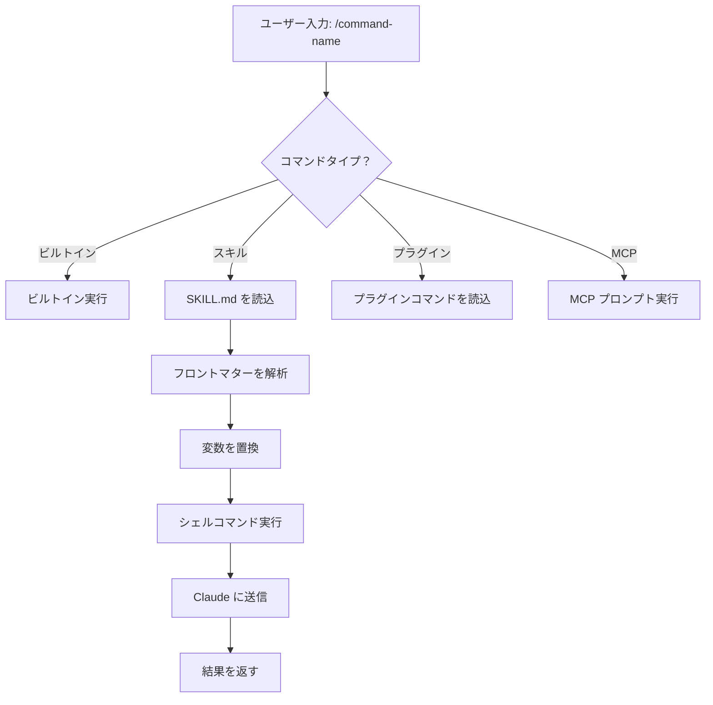
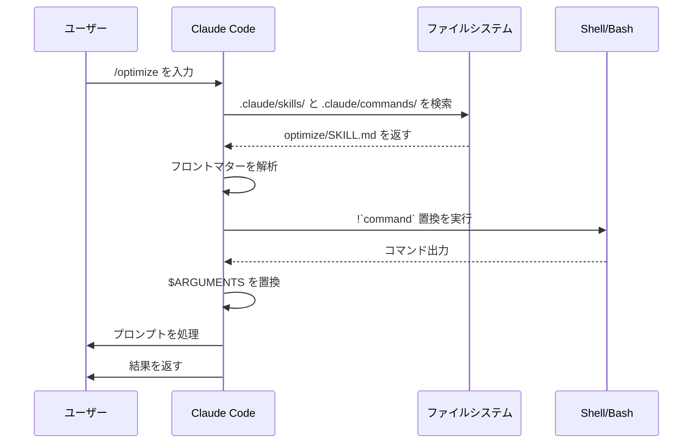

<picture>
  <source media="(prefers-color-scheme: dark)" srcset="../resources/logos/claude-howto-logo-dark.svg">
  
</picture>

# スラッシュコマンド

## 概要

スラッシュコマンドは、対話的セッション中にClaudeの動作を制御するショートカットです。いくつかのタイプがあります：

- **ビルトインコマンド**: Claude Code が提供 (`/help`、`/clear`、`/model`)
- **スキル**: ユーザー定義のコマンド (`SKILL.md`ファイルとして作成) (`/optimize`、`/pr`)
- **プラグインコマンド**: インストール済みプラグインからのコマンド (`/frontend-design:frontend-design`)
- **MCPプロンプト**: MCPサーバーからのコマンド (`/mcp__github__list_prs`)

> **注記**: カスタムスラッシュコマンドはスキルにマージされました。`.claude/commands/`内のファイルは引き続き機能しますが、スキル (`.claude/skills/`) がお勧めの方法です。どちらも `/command-name` ショートカットを作成します。完全なリファレンスは [スキルガイド](../03-skills/) を参照してください。

## ビルトインコマンドリファレンス

ビルトインコマンドは一般的なアクションのショートカットです。**60以上のビルトインコマンド** と **5つのバンドルスキル** が利用可能です。Claude Codeで `/` を入力すると全リストが表示されます。または `/` の後に任意の文字を入力してフィルタリングできます。

| コマンド | 目的 |
|---------|---------|
| `/add-dir <path>` | 作業ディレクトリを追加 |
| `/agents` | エージェント構成を管理 |
| `/branch [name]` | 新しいセッションに会話をブランチ (エイリアス: `/fork`)。注記: `/fork` は v2.1.77 で `/branch` に名前変更されました |
| `/btw <question>` | 履歴に追加しない副質問 |
| `/chrome` | Chrome ブラウザ統合を構成 |
| `/clear` | 会話をクリア (エイリアス: `/reset`、`/new`) |
| `/color [color\|default]` | プロンプトバーの色を設定 |
| `/compact [instructions]` | オプションのフォーカス指示で会話をコンパクト化 |
| `/config` | 設定を開く (エイリアス: `/settings`) |
| `/context` | コンテキスト使用量を色付きグリッドで可視化 |
| `/copy [N]` | アシスタント応答をクリップボードにコピー。`w`でファイルに書き込み |
| `/cost` | トークン使用統計を表示 |
| `/desktop` | デスクトップアプリで続行 (エイリアス: `/app`) |
| `/diff` | 未コミット変更の対話的 diff ビューア |
| `/doctor` | インストールの状態を診断 |
| `/effort [low\|medium\|high\|max\|auto]` | エフォートレベルを設定。`max` には Opus 4.6 が必要 |
| `/exit` | REPL を終了 (エイリアス: `/quit`) |
| `/export [filename]` | 現在の会話をファイルまたはクリップボードにエクスポート |
| `/extra-usage` | レート制限用の追加使用量を構成 |
| `/fast [on\|off]` | ファストモードの切り替え |
| `/feedback` | フィードバックを送信 (エイリアス: `/bug`) |
| `/help` | ヘルプを表示 |
| `/hooks` | フック構成を表示 |
| `/ide` | IDE 統合を管理 |
| `/init` | `CLAUDE.md` を初期化。対話フローの場合は `CLAUDE_CODE_NEW_INIT=1` を設定 |
| `/insights` | セッション分析レポートを生成 |
| `/install-github-app` | GitHub Actions アプリを設定 |
| `/install-slack-app` | Slack アプリをインストール |
| `/keybindings` | キーバインディング構成を開く |
| `/login` | Anthropic アカウントを切り替え |
| `/logout` | Anthropic アカウントからログアウト |
| `/mcp` | MCP サーバーと OAuth を管理 |
| `/memory` | `CLAUDE.md` を編集、自動メモリの切り替え |
| `/mobile` | モバイルアプリ用 QR コード (エイリアス: `/ios`、`/android`) |
| `/model [model]` | 左右矢印でエフォートと共にモデルを選択 |
| `/passes` | Claude Code の無料週を共有 |
| `/permissions` | パーミッションを表示/更新 (エイリアス: `/allowed-tools`) |
| `/plan [description]` | プランモードに入る |
| `/plugin` | プラグインを管理 |
| `/powerup` | アニメーションデモを使用した対話的レッスンで機能を発見 |
| `/privacy-settings` | プライバシー設定 (Pro/Max のみ) |
| `/release-notes` | 変更ログを表示 |
| `/reload-plugins` | アクティブなプラグインを再読込 |
| `/remote-control` | claude.ai からリモート制御 (エイリアス: `/rc`) |
| `/remote-env` | デフォルトリモート環境を構成 |
| `/rename [name]` | セッションを名前変更 |
| `/resume [session]` | 会話を再開 (エイリアス: `/continue`) |
| `/review` | **廃止予定** - 代わりに `code-review` プラグインをインストール |
| `/rewind` | 会話またはコードを巻き戻す (エイリアス: `/checkpoint`) |
| `/sandbox` | サンドボックスモードの切り替え |
| `/schedule [description]` | クラウドスケジュール済みタスクを作成/管理 |
| `/security-review` | セキュリティの脆弱性についてブランチを分析 |
| `/skills` | 利用可能なスキルをリスト |
| `/stats` | 日次使用量、セッション、ストリークを可視化 |
| `/stickers` | Claude Code ステッカーを注文 |
| `/status` | バージョン、モデル、アカウントを表示 |
| `/statusline` | ステータスラインを構成 |
| `/tasks` | バックグラウンドタスクをリスト/管理 |
| `/terminal-setup` | ターミナルキーバインディングを構成 |
| `/theme` | カラーテーマを変更 |
| `/ultraplan <prompt>` | ultraplan セッションでプランを草案作成、ブラウザで確認 |
| `/upgrade` | より高いプランレベルのアップグレードページを開く |
| `/usage` | プラン使用限度とレート制限ステータスを表示 |
| `/voice` | プッシュトークボイス入力の切り替え |

### バンドルスキル

これらのスキルは Claude Code に付属しており、スラッシュコマンドのように呼び出されます：

| スキル | 目的 |
|-------|---------|
| `/batch <instruction>` | worktree を使用した大規模並列変更を調整 |
| `/claude-api` | プロジェクト言語用の Claude API リファレンスを読込 |
| `/debug [description]` | デバッグログを有効化 |
| `/loop [interval] <prompt>` | プロンプトを間隔で繰り返し実行 |
| `/simplify [focus]` | 変更されたファイルをコード品質で確認 |

### 廃止予定のコマンド

| コマンド | ステータス |
|---------|--------|
| `/review` | 廃止予定 - `code-review` プラグインに置き換え |
| `/output-style` | v2.1.73 以降廃止予定 |
| `/fork` | `/branch` に名前変更 (v2.1.77 ではエイリアスとして継続) |
| `/pr-comments` | v2.1.91 で削除 - PR コメントを直接 Claude に質問 |
| `/vim` | v2.1.92 で削除 - /config → Editor mode を使用 |

### 最近の変更

- `/fork` が `/branch` に名前変更され、エイリアスとして `/fork` を保持 (v2.1.77)
- `/output-style` が廃止予定 (v2.1.73)
- `/review` が `code-review` プラグインを優先して廃止予定
- `max` レベルが Opus 4.6 を必要とする `/effort` コマンドが追加
- プッシュトークボイス入力用の `/voice` コマンドが追加
- スケジュール済みタスク作成/管理用の `/schedule` コマンドが追加
- プロンプトバーカスタマイズ用の `/color` コマンドが追加
- v2.1.91 で /pr-comments が削除 - PR コメントを直接 Claude に質問
- v2.1.92 で /vim が削除 - /config → Editor mode を代わりに使用
- ブラウザベースのプラン確認と実行用に /ultraplan が追加
- 対話的機能レッスン用に /powerup が追加
- サンドボックスモードの切り替え用に /sandbox が追加
- `/model` ピッカーが生のモデル ID (例: "Sonnet 4.6") ではなく人間が読める形式を表示 (例: "Sonnet 4.6")
- `/resume` は `/continue` エイリアスをサポート
- MCP プロンプトは `/mcp__<server>__<prompt>` コマンドとして利用可能です ([MCP プロンプトをコマンドとして](#mcp-プロンプトをコマンドとして) を参照)

## カスタムコマンド (現在はスキル)

カスタムスラッシュコマンドは **スキルにマージされました**。どちらのアプローチも `/command-name` で呼び出せるコマンドを作成します：

| アプローチ | 場所 | ステータス |
|----------|------|--------|
| **スキル (推奨)** | `.claude/skills/<name>/SKILL.md` | 現在の標準 |
| **レガシーコマンド** | `.claude/commands/<name>.md` | 引き続き機能 |

スキルとコマンドが同じ名前を共有する場合、**スキルが優先されます**。例えば、`.claude/commands/review.md` と `.claude/skills/review/SKILL.md` の両方が存在する場合、スキル版が使用されます。

### マイグレーションパス

既存の `.claude/commands/` ファイルは変更なしで引き続き機能します。スキルへのマイグレーション：

**前 (コマンド):**
```
.claude/commands/optimize.md
```

**後 (スキル):**
```
.claude/skills/optimize/SKILL.md
```

### スキルを使う理由

スキルはレガシーコマンドに対して追加の機能を提供します：

- **ディレクトリ構造**: スクリプト、テンプレート、リファレンスファイルをバンドル
- **自動呼び出し**: Claude が関連する場合スキルを自動的にトリガー
- **呼び出し制御**: ユーザー、Claude、または両方が呼び出し可能かを選択
- **サブエージェント実行**: `context: fork` で分離されたコンテキストでスキルを実行
- **漸進的ディスクロージャー**: 必要な場合のみ追加ファイルを読込

### カスタムコマンドをスキルとして作成

`SKILL.md` ファイルでディレクトリを作成：

```bash
mkdir -p .claude/skills/my-command
```

**ファイル:** `.claude/skills/my-command/SKILL.md`

```yaml
---
name: my-command
description: このコマンドが何をするか、いつ使用するか
---

# マイコマンド

このコマンドが呼び出されたときに Claude が従う指示。

1. 最初のステップ
2. 2番目のステップ
3. 3番目のステップ
```

### フロントマターリファレンス

| フィールド | 目的 | デフォルト |
|--------|---------|---------|
| `name` | コマンド名 (`/name` になる) | ディレクトリ名 |
| `description` | 簡潔な説明 (Claude が使用時期を知るのに役立つ) | 最初の段落 |
| `argument-hint` | オートコンプリーション用の予想される引数 | なし |
| `allowed-tools` | パーミッションなしでコマンドが使用できるツール | 継承 |
| `model` | 使用する特定のモデル | 継承 |
| `disable-model-invocation` | `true` の場合、ユーザーのみが呼び出し可能 (Claude ではない) | `false` |
| `user-invocable` | `false` の場合、`/` メニューから非表示 | `true` |
| `context` | 分離されたサブエージェントで実行する場合は `fork` に設定 | なし |
| `agent` | `context: fork` を使用する場合のエージェントタイプ | `general-purpose` |
| `hooks` | スキルスコープのフック (PreToolUse、PostToolUse、Stop) | なし |

### 引数

コマンドは引数を受け取ることができます：

**`$ARGUMENTS` を持つすべての引数:**

```yaml
---
name: fix-issue
description: GitHub の問題を番号で修正
---

コーディング標準に従って問題 #$ARGUMENTS を修正
```

使用方法: `/fix-issue 123` → `$ARGUMENTS` が "123" になる

**`$0`、`$1` などの個々の引数:**

```yaml
---
name: review-pr
description: 優先度付きで PR をレビュー
---

PR #$0 を優先度 $1 でレビュー
```

使用方法: `/review-pr 456 high` → `$0`="456"、`$1`="high"

### シェルコマンドによる動的コンテキスト

バックティック (`) を使用してプロンプトの前に bash コマンドを実行：

```yaml
---
name: commit
description: コンテキストを含む git コミットを作成
allowed-tools: Bash(git *)
---

## コンテキスト

- 現在の git ステータス: !`git status`
- 現在の git diff: !`git diff HEAD`
- 現在のブランチ: !`git branch --show-current`
- 最近のコミット: !`git log --oneline -5`

## タスク

上記の変更に基づいて、単一の git コミットを作成します。
```

### ファイル参照

`@` を使用してファイル内容を含める：

```markdown
@src/utils/helpers.js の実装をレビュー
@src/old-version.js と @src/new-version.js を比較
```

## プラグインコマンド

プラグインはカスタムコマンドを提供できます：

```
/plugin-name:command-name
```

または命名の競合がない場合は `/command-name`。

**例:**
```bash
/frontend-design:frontend-design
/commit-commands:commit
```

## MCP プロンプトをコマンドとして

MCP サーバーはプロンプトをスラッシュコマンドとして公開できます：

```
/mcp__<server-name>__<prompt-name> [arguments]
```

**例:**
```bash
/mcp__github__list_prs
/mcp__github__pr_review 456
/mcp__jira__create_issue "バグタイトル" high
```

### MCP パーミッション構文

パーミッションで MCP サーバーアクセスを制御：

- `mcp__github` - GitHub MCP サーバー全体へのアクセス
- `mcp__github__*` - すべてのツールへのワイルドカードアクセス
- `mcp__github__get_issue` - 特定のツールアクセス

## コマンドアーキテクチャ



## コマンドライフサイクル



## このフォルダで利用可能なコマンド

これらの例コマンドはスキルまたはレガシーコマンドとしてインストールできます。

### 1. `/optimize` - コード最適化

パフォーマンスの問題、メモリリーク、最適化の機会についてコードを分析します。

**使用方法:**
```
/optimize
[コードを貼り付け]
```

### 2. `/pr` - プルリクエスト準備

リント、テスト、コミット形式を含むPR準備チェックリストをガイド。

**使用方法:**
```
/pr
```

**スクリーンショット:**


### 3. `/generate-api-docs` - API ドキュメントジェネレータ

ソースコードから包括的な API ドキュメントを生成します。

**使用方法:**
```
/generate-api-docs
```

### 4. `/commit` - コンテキストを含む Git コミット

リポジトリからの動的コンテキストを使用して git コミットを作成します。

**使用方法:**
```
/commit [optional message]
```

### 5. `/push-all` - ステージ、コミット、プッシュ

すべての変更をステージし、コミットを作成し、安全性チェック付きでリモートにプッシュします。

**使用方法:**
```
/push-all
```

**安全性チェック:**
- シークレット: `.env*`、`*.key`、`*.pem`、`credentials.json`
- API キー: 実際のキーと プレースホルダーを検出
- 大容量ファイル: `>10MB` (Git LFS なし)
- ビルドアーティファクト: `node_modules/`、`dist/`、`__pycache__/`

### 6. `/doc-refactor` - ドキュメント再構成

プロジェクトドキュメントを再構成して、明確さとアクセシビリティを向上させます。

**使用方法:**
```
/doc-refactor
```

### 7. `/setup-ci-cd` - CI/CD パイプラインセットアップ

品質保証用のプリコミットフックと GitHub Actions を実装します。

**使用方法:**
```
/setup-ci-cd
```

### 8. `/unit-test-expand` - テストカバレッジ拡張

テストされていないブランチとエッジケースをターゲットにしてテストカバレッジを増やします。

**使用方法:**
```
/unit-test-expand
```

## インストール

### スキルとして (推奨)

スキルディレクトリにコピー：

```bash
# スキルディレクトリを作成
mkdir -p .claude/skills

# コマンドファイルごと、スキルディレクトリを作成
for cmd in optimize pr commit; do
  mkdir -p .claude/skills/$cmd
  cp 01-slash-commands/$cmd.md .claude/skills/$cmd/SKILL.md
done
```

### レガシーコマンドとして

コマンドディレクトリにコピー：

```bash
# プロジェクト全体 (チーム)
mkdir -p .claude/commands
cp 01-slash-commands/*.md .claude/commands/

# 個人用
mkdir -p ~/.claude/commands
cp 01-slash-commands/*.md ~/.claude/commands/
```

## 独自のコマンドを作成

### スキルテンプレート (推奨)

`.claude/skills/my-command/SKILL.md` を作成：

```yaml
---
name: my-command
description: このコマンドが何をするか。[トリガー条件] の場合に使用します。
argument-hint: [optional-args]
allowed-tools: Bash(npm *), Read, Grep
---

# コマンドタイトル

## コンテキスト

- 現在のブランチ: !`git branch --show-current`
- 関連ファイル: @package.json

## 指示

1. 最初のステップ
2. 引数を含む 2番目のステップ: $ARGUMENTS
3. 3番目のステップ

## 出力形式

- 応答をフォーマットする方法
- 含めるもの
```

### ユーザーのみのコマンド (自動呼び出しなし)

副作用があるコマンドの場合、Claude が自動的にトリガーするべきではありません：

```yaml
---
name: deploy
description: 本番環境にデプロイ
disable-model-invocation: true
allowed-tools: Bash(npm *), Bash(git *)
---

アプリケーションを本番環境にデプロイします：

1. テストを実行
2. アプリケーションを構築
3. デプロイ対象にプッシュ
4. デプロイを検証
```

## ベストプラクティス

| 推奨 | 非推奨 |
|------|---------|
| 明確で行動指向の名前を使用 | 1回限りのタスク向けコマンドを作成 |
| トリガー条件で `description` を含める | コマンドで複雑なロジックを構築 |
| コマンドを単一タスクに集中 | 機密情報をハードコード |
| 副作用には `disable-model-invocation` を使用 | description フィールドをスキップ |
| 動的コンテキストに `!` プリフィックスを使用 | Claude が現在の状態を知っていると仮定 |
| スキルディレクトリで関連ファイルを整理 | すべてを 1 つのファイルに置く |

## トラブルシューティング

### コマンドが見つからない

**ソリューション:**
- ファイルが `.claude/skills/<name>/SKILL.md` または `.claude/commands/<name>.md` にあることを確認
- フロントマターの `name` フィールドが期待されるコマンド名と一致することを確認
- Claude Code セッションを再開
- `/help` を実行して利用可能なコマンドを表示

### コマンドが期待どおりに実行されない

**ソリューション:**
- より具体的な指示を追加
- スキルファイルに例を含める
- bash コマンドを使用する場合は `allowed-tools` を確認
- 最初に単純な入力でテスト

### スキルとコマンドの競合

同じ名前で両方が存在する場合、**スキルが優先されます**。一方を削除するか名前を変更してください。

## 関連ガイド

- **[スキル](../03-skills/)** - スキルの完全なリファレンス (自動呼び出し機能)
- **[メモリ](../02-memory/)** - CLAUDE.md による永続的なコンテキスト
- **[サブエージェント](../04-subagents/)** - 委任されたAIエージェント
- **[プラグイン](../07-plugins/)** - バンドルコマンドコレクション
- **[フック](../06-hooks/)** - イベント駆動型の自動化

## 追加リソース

- [公式対話モードドキュメント](https://code.claude.com/docs/en/interactive-mode) - ビルトインコマンドリファレンス
- [公式スキルドキュメント](https://code.claude.com/docs/en/skills) - 完全なスキルリファレンス
- [CLI リファレンス](https://code.claude.com/docs/en/cli-reference) - コマンドラインオプション

---
**最終更新**: 2026年4月9日
**Claude Code バージョン**: 2.1.97
**互換モデル**: Claude Sonnet 4.6、Claude Opus 4.6、Claude Haiku 4.5

*[Claude How To](../) ガイドシリーズの一部*
