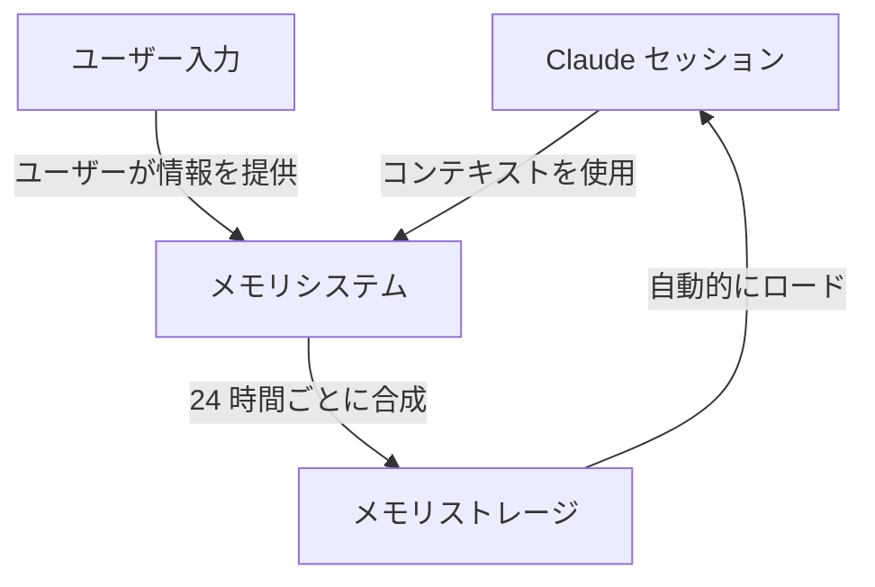
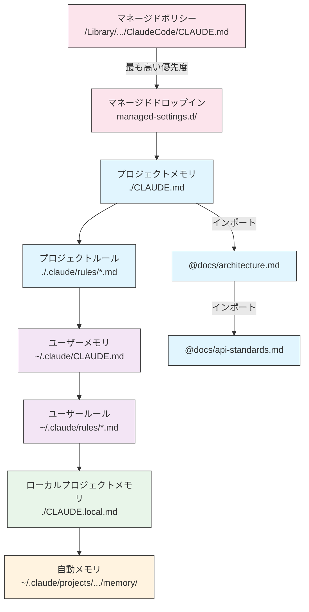
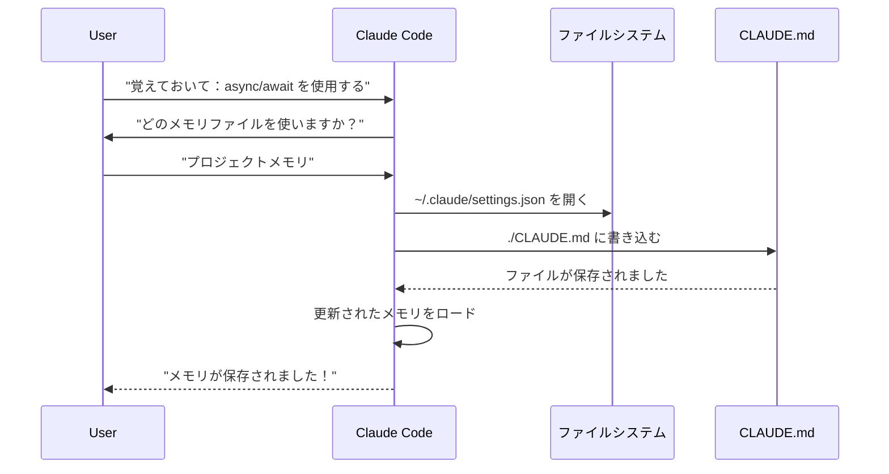
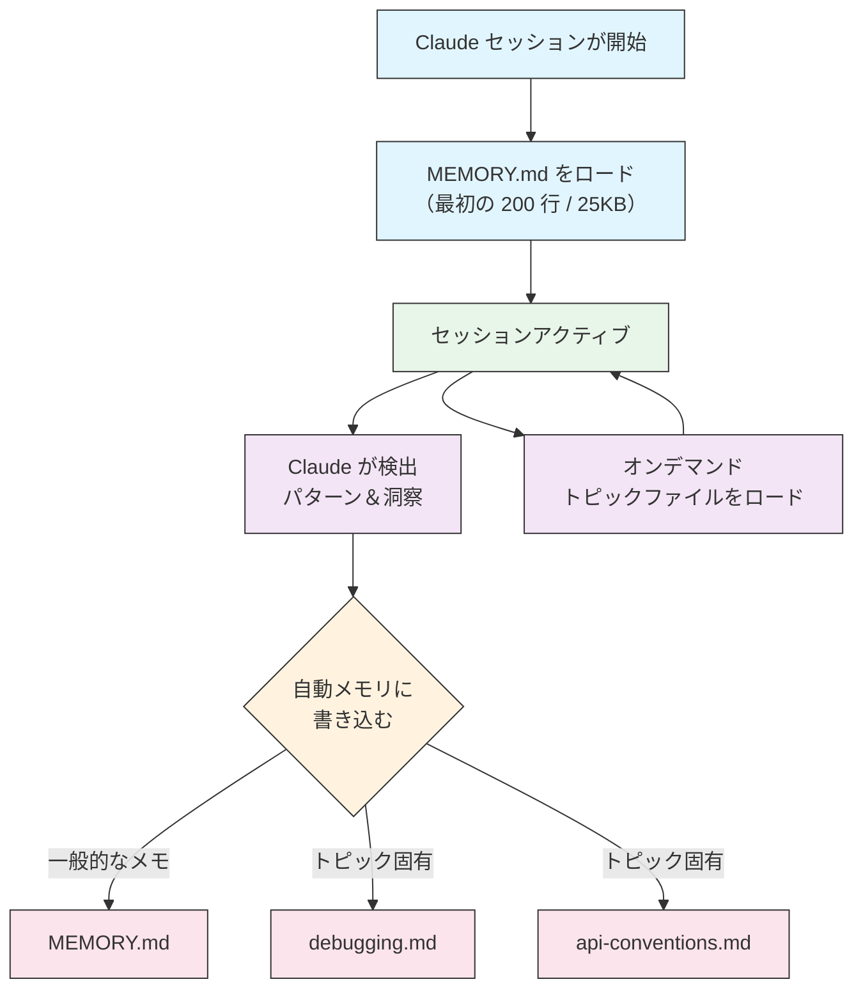

<picture>
  <source media="(prefers-color-scheme: dark)" srcset="../resources/logos/claude-howto-logo-dark.svg">
  
</picture>

# メモリガイド

メモリにより、Claude Code はセッション間およびコンバーセーション間でコンテキストを保持できます。claude.ai での自動合成と、Claude Code でのファイルシステムベースの CLAUDE.md という 2 つの形式があります。

## 概要

Claude Code のメモリは、複数のセッションおよびコンバーセーション全体で持続するコンテキストを提供します。一時的なコンテキストウィンドウとは異なり、メモリファイルは以下を可能にします。

- プロジェクト標準をチーム全体で共有できます
- 個人開発の設定を保存できます
- ディレクトリ固有のルールと設定を管理できます
- 外部ドキュメントをインポートできます
- メモリをプロジェクトの一部としてバージョン管理できます

メモリシステムは複数のレベルで動作し、グローバルな個人設定から特定のサブディレクトリまで、Claude が何を記憶し、どのようにその知識を適用するかについて細粒度の制御を可能にします。

## メモリコマンド高速リファレンス

| コマンド | 目的 | 用法 | 使用時期 |
|---------|------|------|---------|
| `/init` | プロジェクトメモリを初期化する | `/init` | 新しいプロジェクトの開始、最初の CLAUDE.md セットアップ |
| `/memory` | エディターでメモリファイルを編集する | `/memory` | 大規模な更新、再編成、コンテンツのレビュー |
| `#` プレフィックス | ~~1 行のメモリを素早く追加~~ **廃止** | — | `/memory` または会話で代わりにお願いしてください |
| `@path/to/file` | 外部コンテンツをインポートする | `@README.md` または `@docs/api.md` | CLAUDE.md で既存ドキュメントを参照する場合 |

## クイックスタート: メモリの初期化

### `/init` コマンド

`/init` コマンドは、Claude Code のプロジェクトメモリをセットアップする最速の方法です。これにより、基本的なプロジェクトドキュメントを含む CLAUDE.md ファイルが初期化されます。

**使用法:**

```bash
/init
```

**実行内容:**

- プロジェクト内に新しい CLAUDE.md ファイルを作成します（通常は `./CLAUDE.md` または `./.claude/CLAUDE.md`）
- プロジェクト規約とガイドラインを確立します
- セッション間でのコンテキスト永続化の基盤を設定します
- プロジェクト標準を文書化するためのテンプレート構造を提供します

**強化されたインタラクティブモード:** `CLAUDE_CODE_NEW_INIT=1` を設定して、プロジェクトセットアップを段階的に進むマルチフェーズインタラクティブフローを有効にします。

```bash
CLAUDE_CODE_NEW_INIT=1 claude
/init
```

**`/init` を使用する場合:**

- Claude Code で新しいプロジェクトを開始する場合
- チーム的なコーディング標準と規約を確立する場合
- コードベース構造に関するドキュメントを作成する場合
- 協調開発のためのメモリ階層をセットアップする場合

**例のワークフロー:**

```markdown
# プロジェクトディレクトリで
/init

# Claude は以下のような構造で CLAUDE.md を作成します。
# プロジェクト設定
## プロジェクト概要
- 名前: あなたのプロジェクト
- 技術スタック: [あなたの技術]
- チームサイズ: [開発者の数]

## 開発標準
- コードスタイルの設定
- テスト要件
- Git ワークフロー規約
```

### メモリの素早い更新

> **注意**: インラインメモリの `#` ショートカットは廃止されました。メモリファイルを直接編集するには `/memory` を使用するか、Claude に何かを覚えてもらうようにお願いしてください（例：「このプロジェクトでは常に TypeScript の厳密モードを使用することを覚えてください」）。

メモリに情報を追加する推奨方法は次の通りです。

**オプション 1: `/memory` コマンドを使用する**

```bash
/memory
```

システムエディターでメモリファイルを直接編集できるように開きます。

**オプション 2: 会話で尋ねる**

```
このプロジェクトでは常に TypeScript 厳密モードを使用することを覚えてください。
メモリに追加してください: 非同期/待機をプロミスチェーンより好む。
```

Claude は要求に基づいて適切な CLAUDE.md ファイルを更新します。

**歴史的参考** (機能していません):

`#` プレフィックスショートカットは以前、ルールをインラインで追加できました:

```markdown
# このプロジェクトでは常に TypeScript 厳密モードを使用する  ← これはもう機能しません
```

このパターンに依存していた場合は、`/memory` コマンドまたは会話請求に切り替えてください。

### `/memory` コマンド

`/memory` コマンドは、Claude Code セッション内で CLAUDE.md メモリファイルを編集するための直接アクセスを提供します。システムエディターでメモリファイルを開いて包括的な編集ができます。

**使用法:**

```bash
/memory
```

**実行内容:**

- メモリファイルをシステムのデフォルトエディターで開きます
- 大規模な追加、修正、再編成ができます
- 階層内のすべてのメモリファイルへの直接アクセスを提供します
- セッション間で持続するコンテキストを管理できます

**`/memory` を使用する場合:**

- 既存のメモリコンテンツをレビューする場合
- プロジェクト標準への大規模な更新を実施する場合
- メモリ構造を再編成する場合
- 詳細なドキュメントまたはガイドラインを追加する場合
- プロジェクトが進化するにつれてメモリを保守・更新する場合

**比較: `/memory` と `/init`**

| 側面 | `/memory` | `/init` |
|-----|----------|---------|
| **目的** | 既存のメモリファイルを編集する | 新しい CLAUDE.md を初期化する |
| **使用時期** | プロジェクトコンテキストを更新・修正する | 新しいプロジェクトを開始する |
| **アクション** | 変更用のエディターを開く | スターターテンプレートを生成する |
| **ワークフロー** | 継続的な保守 | ワンタイムセットアップ |

**例のワークフロー:**

```markdown
# メモリを編集用に開く
/memory

# Claude はオプションを表示します:
# 1. マネージドポリシーメモリ
# 2. プロジェクトメモリ (./CLAUDE.md)
# 3. ユーザーメモリ (~/.claude/CLAUDE.md)
# 4. ローカルプロジェクトメモリ

# オプション 2（プロジェクトメモリ）を選択
# デフォルトエディターが ./CLAUDE.md コンテンツで開きます

# 変更して保存し、エディターを閉じます
# Claude は自動的に更新されたメモリを再ロードします
```

**メモリインポートの使用:**

CLAUDE.md ファイルは、外部コンテンツを含めるために `@path/to/file` 構文をサポートしています。

```markdown
# プロジェクトドキュメント
@README.md でプロジェクト概要を確認してください
@package.json で使用可能な npm コマンドを確認してください
@docs/architecture.md でシステム設計を確認してください

# ホームディレクトリから絶対パスを使用してインポート
@~/.claude/my-project-instructions.md
```

**インポート機能:**

- 相対パスと絶対パス の両方がサポートされています（例：`@docs/api.md` または `@~/.claude/my-project-instructions.md`）
- 再帰的インポートがサポートされており、最大深さは 5 です
- 外部ロケーションからの最初のインポートは許可ダイアログをトリガーします
- インポートディレクティブはマークダウンコードスパンまたはコードブロック内では評価されません（例に文書化する場合でも安全です）
- 既存ドキュメントを参照することで重複を回避します
- 参照されたコンテンツを Claude のコンテキストに自動的に含めます

## メモリアーキテクチャ

Claude Code のメモリは階層的なシステムに従い、異なるスコープが異なる目的を果たします。



## Claude Code でのメモリ階層

Claude Code はマルチティア階層メモリシステムを使用します。メモリファイルは Claude Code の起動時に自動的にロードされ、上位レベルのファイルが優先されます。

**完全なメモリ階層（優先順位順）:**

1. **マネージドポリシー** - 組織全体の指示
   - macOS: `/Library/Application Support/ClaudeCode/CLAUDE.md`
   - Linux/WSL: `/etc/claude-code/CLAUDE.md`
   - Windows: `C:\Program Files\ClaudeCode\CLAUDE.md`

2. **マネージドドロップイン** - アルファベット順にマージされるポリシーファイル (v2.1.83+)
   - マネージドポリシー CLAUDE.md の横にある `managed-settings.d/` ディレクトリ
   - ファイルはアルファベット順にマージされ、モジュール式ポリシー管理が可能です

3. **プロジェクトメモリ** - チーム共有コンテキスト（バージョン管理）
   - `./.claude/CLAUDE.md` または `./CLAUDE.md`（リポジトリのルート）

4. **プロジェクトルール** - モジュール式のトピック固有プロジェクト指示
   - `./.claude/rules/*.md`

5. **ユーザーメモリ** - 個人設定（すべてのプロジェクト）
   - `~/.claude/CLAUDE.md`

6. **ユーザーレベルルール** - 個人ルール（すべてのプロジェクト）
   - `~/.claude/rules/*.md`

7. **ローカルプロジェクトメモリ** - 個人的なプロジェクト固有の設定
   - `./CLAUDE.local.md`

> **注意**: `CLAUDE.local.md` は完全にサポートされており、[公式ドキュメント](https://code.claude.com/docs/en/memory)で文書化されています。バージョン管理にコミットされない、個人的なプロジェクト固有の設定を提供します。`CLAUDE.local.md` を `.gitignore` に追加してください。

8. **自動メモリ** - Claude の自動メモと学習
   - `~/.claude/projects/<project>/memory/`

**メモリ検出の動作:**

Claude はこの順序でメモリファイルを検索し、前のロケーションが優先されます。



## `claudeMdExcludes` を使用した CLAUDE.md ファイルの除外

大規模なモノレポでは、いくつかの CLAUDE.md ファイルが現在の作業に関連がない場合があります。`claudeMdExcludes` 設定により、特定の CLAUDE.md ファイルをスキップして、コンテキストにロードしないようにできます。

```jsonc
// ~/.claude/settings.json または .claude/settings.json 内
{
  "claudeMdExcludes": [
    "packages/legacy-app/CLAUDE.md",
    "vendors/**/CLAUDE.md"
  ]
}
```

パターンはプロジェクトのルートを基準とした相対パスに対してマッチします。これは特に以下の場合に便利です。

- 関連するプロジェクトのみが関連するモノレポの場合
- ベンダー化または サードパーティの CLAUDE.md ファイルを含むリポジトリ
- 古い、または関連のない指示を除外することで Claude のコンテキストウィンドウのノイズを削減します

## 設定ファイル階層

Claude Code の設定（`autoMemoryDirectory`、`claudeMdExcludes` など）は、5 レベルの階層から解決されます。上位レベルが優先されます。

| レベル | ロケーション | スコープ |
|--------|-------------|---------|
| 1（最も高い） | マネージドポリシー（システムレベル） | 組織全体の強制 |
| 2 | `managed-settings.d/` (v2.1.83+) | モジュール式ポリシードロップイン、アルファベット順にマージ |
| 3 | `~/.claude/settings.json` | ユーザー設定 |
| 4 | `.claude/settings.json` | プロジェクトレベル（git にコミット） |
| 5（最も低い） | `.claude/settings.local.json` | ローカルオーバーライド（git で無視） |

**プラットフォーム固有の設定 (v2.1.51+):**

設定は次の方法でも構成できます。
- **macOS**: Property List (plist) ファイル
- **Windows**: Windows レジストリ

これらのプラットフォームネイティブなメカニズムは JSON 設定ファイルと共に読み込まれ、同じ優先順位ルールに従います。

## モジュール式ルールシステム

`.claude/rules/` ディレクトリ構造を使用して、整理された、パス固有のルールを作成します。ルールはプロジェクトレベルとユーザーレベルの両方で定義できます。

```
your-project/
├── .claude/
│   ├── CLAUDE.md
│   └── rules/
│       ├── code-style.md
│       ├── testing.md
│       ├── security.md
│       └── api/                  # サブディレクトリがサポートされています
│           ├── conventions.md
│           └── validation.md

~/.claude/
├── CLAUDE.md
└── rules/                        # ユーザーレベルルール（すべてのプロジェクト）
    ├── personal-style.md
    └── preferred-patterns.md
```

ルールは `rules/` ディレクトリ内で再帰的に検出されます。`~/.claude/rules/` のユーザーレベルルールはプロジェクトレベルルールの前にロードされるため、プロジェクトがオーバーライドできる個人的なデフォルト値が可能になります。

### YAML フロントマターを使用したパス固有ルール

特定のファイルパスにのみ適用するルールを定義します。

```markdown
---
paths: src/api/**/*.ts
---

# API 開発ルール

- すべての API エンドポイントは入力検証を含める必要があります
- スキーマ検証には Zod を使用してください
- すべてのパラメーターとレスポンスタイプを文書化してください
- すべての操作にエラーハンドリングを含めてください
```

**グロブパターンの例:**

- `**/*.ts` - すべての TypeScript ファイル
- `src/**/*` - src/ の下のすべてのファイル
- `src/**/*.{ts,tsx}` - 複数の拡張子
- `{src,lib}/**/*.ts, tests/**/*.test.ts` - 複数のパターン

### サブディレクトリとシンボリックリンク

`.claude/rules/` のルールは 2 つの組織機能をサポートしています。

- **サブディレクトリ**: ルールは再帰的に検出されるため、トピックベースのフォルダに整理できます（例：`rules/api/`、`rules/testing/`、`rules/security/`）
- **シンボリックリンク**: シンボリックリンクは複数のプロジェクト間でルールを共有できます。たとえば、中央ロケーションから各プロジェクトの `.claude/rules/` ディレクトリへの共有ルールファイルのシンボリックリンクができます。

## メモリロケーションテーブル

| ロケーション | スコープ | 優先度 | 共有 | アクセス | 最適用途 |
|------------|---------|--------|------|----------|-----------|
| `/Library/Application Support/ClaudeCode/CLAUDE.md` (macOS) | マネージドポリシー | 1（最も高い） | 組織 | システム | 企業全体のポリシー |
| `/etc/claude-code/CLAUDE.md` (Linux/WSL) | マネージドポリシー | 1（最も高い） | 組織 | システム | 組織標準 |
| `C:\Program Files\ClaudeCode\CLAUDE.md` (Windows) | マネージドポリシー | 1（最も高い） | 組織 | システム | 企業ガイドライン |
| `managed-settings.d/*.md` (ポリシーの横) | マネージドドロップイン | 1.5 | 組織 | システム | モジュール式ポリシーファイル (v2.1.83+) |
| `./CLAUDE.md` または `./.claude/CLAUDE.md` | プロジェクトメモリ | 2 | チーム | Git | チーム標準、共有アーキテクチャ |
| `./.claude/rules/*.md` | プロジェクトルール | 3 | チーム | Git | パス固有、モジュール式ルール |
| `~/.claude/CLAUDE.md` | ユーザーメモリ | 4 | 個人 | ファイルシステム | 個人設定（すべてのプロジェクト） |
| `~/.claude/rules/*.md` | ユーザールール | 5 | 個人 | ファイルシステム | 個人ルール（すべてのプロジェクト） |
| `./CLAUDE.local.md` | プロジェクトローカル | 6 | 個人 | Git（無視） | 個人的なプロジェクト固有の設定 |
| `~/.claude/projects/<project>/memory/` | 自動メモリ | 7（最も低い） | 個人 | ファイルシステム | Claude の自動メモと学習 |

## メモリ更新ライフサイクル

メモリ更新が Claude Code セッションを通じてどのように流れるかを次に示します。



## 自動メモリ

自動メモリは持続的なディレクトリで、Claude はプロジェクトで作業するときに学習、パターン、洞察を自動的に記録します。手動で作成して維持する CLAUDE.md ファイルとは異なり、自動メモリはセッション中に Claude 自身によって記述されます。

### 自動メモリの仕組み

- **ロケーション**: `~/.claude/projects/<project>/memory/`
- **エントリポイント**: `MEMORY.md` は自動メモリディレクトリのメインファイルとして機能します
- **トピックファイル**: 特定の主題用のオプションの追加ファイル（例：`debugging.md`、`api-conventions.md`）
- **ロード動作**: `MEMORY.md` の最初の 200 行（または最初の 25KB、どちらか小さい方）がセッション開始時にコンテキストにロードされます。トピックファイルはスタートアップではなく、オンデマンドでロードされます。
- **読み取り/書き込み**: Claude はセッション中に、パターンとプロジェクト固有の知識を検出するときにメモリファイルを読み取り、書き込みます。

### 自動メモリアーキテクチャ



### 自動メモリディレクトリ構造

```
~/.claude/projects/<project>/memory/
├── MEMORY.md              # エントリポイント（最初の 200 行 / 25KB がスタートアップ時にロード）
├── debugging.md           # トピックファイル（オンデマンドでロード）
├── api-conventions.md     # トピックファイル（オンデマンドでロード）
└── testing-patterns.md    # トピックファイル（オンデマンドでロード）
```

### バージョン要件

自動メモリには **Claude Code v2.1.59 以降** が必要です。古いバージョンを使用している場合は、まずアップグレードしてください。

```bash
npm install -g @anthropic-ai/claude-code@latest
```

### カスタム自動メモリディレクトリ

デフォルトでは、自動メモリは `~/.claude/projects/<project>/memory/` に保存されます。`autoMemoryDirectory` 設定を使用してこのロケーションを変更できます（**v2.1.74** 以降で利用可能）:

```jsonc
// ~/.claude/settings.json または .claude/settings.local.json 内（ユーザー/ローカル設定のみ）
{
  "autoMemoryDirectory": "/path/to/custom/memory/directory"
}
```

> **注意**: `autoMemoryDirectory` はユーザーレベル（`~/.claude/settings.json`）またはローカル設定（`.claude/settings.local.json`）にのみ設定でき、プロジェクトまたはマネージドポリシー設定には設定できません。

これは以下の場合に便利です。

- 共有またはシンク済みロケーションに自動メモリを保存したい場合
- 自動メモリをデフォルト Claude 設定ディレクトリから分離したい場合
- デフォルト階層の外のプロジェクト固有パスを使用したい場合

### ワークツリーとリポジトリ共有

同じ Git リポジトリ内のすべてのワークツリーとサブディレクトリは、単一の自動メモリディレクトリを共有します。これは、ワークツリー間で切り替えるか、リポジトリの異なるサブディレクトリで作業する際に、同じメモリファイルに読み書きすることを意味します。

### サブエージェントメモリ

サブエージェント（タスクや並列実行などのツール経由でスポーンされます）は独自のメモリコンテキストを持つことができます。サブエージェント定義で `memory` フロントマターフィールドを使用して、ロードするメモリスコープを指定します。

```yaml
memory: user      # ユーザーレベルのメモリのみをロード
memory: project   # プロジェクトレベルのメモリのみをロード
memory: local     # ローカルメモリのみをロード
```

これにより、サブエージェントは完全なメモリ階層を継承するのではなく、焦点を当てたコンテキストで動作できます。

> **注意**: サブエージェントは独自の自動メモリを維持することもできます。詳細は [公式サブエージェントメモリドキュメント](https://code.claude.com/docs/en/sub-agents#enable-persistent-memory)を参照してください。

### 自動メモリの制御

自動メモリは `CLAUDE_CODE_DISABLE_AUTO_MEMORY` 環境変数を使用して制御できます。

| 値 | 動作 |
|----|------|
| `0` | 自動メモリを **オン** に強制 |
| `1` | 自動メモリを **オフ** に強制 |
| *(未設定)* | デフォルト動作（自動メモリ有効） |

```bash
# セッションの自動メモリを無効化
CLAUDE_CODE_DISABLE_AUTO_MEMORY=1 claude

# 明確に自動メモリをオンに強制
CLAUDE_CODE_DISABLE_AUTO_MEMORY=0 claude
```

## `--add-dir` を使用した追加ディレクトリ

`--add-dir` フラグにより、Claude Code は現在の作業ディレクトリ以外の追加ディレクトリから CLAUDE.md ファイルをロードできます。これはモノレポまたはマルチプロジェクトセットアップで、他のディレクトリのコンテキストが関連する場合に便利です。

この機能を有効にするには、環境変数を設定します。

```bash
CLAUDE_CODE_ADDITIONAL_DIRECTORIES_CLAUDE_MD=1
```

その後、フラグを使用して Claude Code を起動します。

```bash
claude --add-dir /path/to/other/project
```

Claude は現在の作業ディレクトリのメモリファイルと共に、指定された追加ディレクトリから CLAUDE.md をロードします。

## 実用例

### 例 1: プロジェクトメモリ構造

**ファイル:** `./CLAUDE.md`

```markdown
# プロジェクト設定

## プロジェクト概要
- **名前**: e コマース プラットフォーム
- **技術スタック**: Node.js、PostgreSQL、React 18、Docker
- **チームサイズ**: 5 人の開発者
- **期限**: 2025 年 Q4

## アーキテクチャ
@docs/architecture.md
@docs/api-standards.md
@docs/database-schema.md

## 開発標準

### コードスタイル
- Prettier を使用してフォーマットする
- ESLint と airbnb config を使用する
- 最大行長: 100 文字
- 2 スペースのインデントを使用する

### 命名規約
- **ファイル**: ケバブケース (user-controller.js)
- **クラス**: PascalCase (UserService)
- **関数/変数**: camelCase (getUserById)
- **定数**: UPPER_SNAKE_CASE (API_BASE_URL)
- **データベーステーブル**: snake_case (user_accounts)

### Git ワークフロー
- ブランチ名: `feature/description` または `fix/description`
- コミットメッセージ: 従来のコミットに従う
- マージ前に PR が必要
- すべての CI/CD チェックが必須
- 最小 1 つの承認が必要

### テスト要件
- 最小 80% コードカバレッジ
- すべてのクリティカルパスはテストが必要
- ユニットテストに Jest を使用
- E2E テストに Cypress を使用
- テストファイル名: `*.test.ts` または `*.spec.ts`

### API 標準
- REST ful エンドポイントのみ
- JSON リクエスト/レスポンス
- HTTP ステータスコードを正しく使用
- API エンドポイントをバージョン管理: `/api/v1/`
- すべてのエンドポイントを例で文書化

### データベース
- スキーマ変更にはマイグレーションを使用
- 認証情報をハードコードしない
- コネクションプーリングを使用
- 開発でクエリログを有効化
- 定期的なバックアップが必要

### デプロイ
- Docker ベースのデプロイ
- Kubernetes オーケストレーション
- ブルーグリーンデプロイメント戦略
- 障害時の自動ロールバック
- デプロイ前にデータベースマイグレーションを実行
```

### 例 2: ディレクトリ固有のメモリ

**ファイル:** `./src/api/CLAUDE.md`

````markdown
# API モジュール標準

このファイルは、/src/api/ 内のすべてに対してルート CLAUDE.md をオーバーライドします。

## API 固有の標準

### リクエスト検証
- スキーマ検証には Zod を使用してください
- 常に入力を検証してください
- 検証エラー時は 400 を返す
- フィールドレベルのエラー詳細を含める

### 認証
- すべてのエンドポイントに JWT トークンが必要です
- Authorization ヘッダー内のトークン
- トークンは 24 時間後に期限切れ
- リフレッシュトークンメカニズムを実装する

### レスポンス形式

すべてのレスポンスは次の構造に従う必要があります。

```json
{
  "success": true,
  "data": { /* 実際のデータ */ },
  "timestamp": "2025-11-06T10:30:00Z",
  "version": "1.0"
}
```

エラーレスポンス:
```json
{
  "success": false,
  "error": {
    "code": "VALIDATION_ERROR",
    "message": "ユーザーメッセージ",
    "details": { /* フィールドエラー */ }
  },
  "timestamp": "2025-11-06T10:30:00Z"
}
```

### ページネーション
- カーソルベースのページネーション（オフセットではない）を使用
- `hasMore` ブール値を含める
- 最大ページサイズを 100 に制限
- デフォルトページサイズ: 20

### レート制限
- 認証されたユーザーの場合は 1 時間あたり 1000 リクエスト
- パブリックエンドポイントの場合は 1 時間あたり 100 リクエスト
- 超過時は 429 を返す
- retry-after ヘッダーを含める

### キャッシュ
- セッションキャッシュに Redis を使用
- キャッシュ期間: デフォルト 5 分
- 書き込み操作でインバリデーション
- リソースタイプでキャッシュキーにタグを付与
````

### 例 3: 個人メモリ

**ファイル:** `~/.claude/CLAUDE.md`

```markdown
# 自分の開発設定

## 自分について
- **経験レベル**: 8 年間のフルスタック開発
- **優先言語**: TypeScript、Python
- **コミュニケーションスタイル**: 直接的、例を含める
- **学習スタイル**: コード付きの図表

## コード設定

### エラーハンドリング
try-catch ブロックと意味のあるエラーメッセージを使用した明示的なエラーハンドリングが好きです。
ジェネリックエラーを避けます。デバッグのためにエラーを常にログします。

### コメント
コメントは「何」ではなく「なぜ」について記述してください。コードは自己説明的である必要があります。
コメントはビジネスロジックまたは明白でない決定を説明する必要があります。

### テスト
TDD（テスト駆動開発）が好きです。
まずテストを書き、次に実装します。
実装詳細ではなく動作に焦点を当てます。

### アーキテクチャ
モジュール式で疎結合の設計を好みます。
テストの容易性のために依存性注入を使用してください。
関心の分離（Controllers、Services、Repositories）。

## デバッグ設定
- コンソール.log をプレフィックス `[DEBUG]` で使用
- コンテキストを含める: 関数名、関連する変数
- 利用可能な場合はスタックトレースを使用
- ログに常にタイムスタンプを含める

## コミュニケーション
- 図を使用して複雑な概念を説明
- 理論を説明する前に具体的な例を示す
- 前後のコードスニペットを含める
- 最後に重要なポイントをまとめる

## プロジェクト組織
プロジェクトを次のように整理しています。

   project/
   ├── src/
   │   ├── api/
   │   ├── services/
   │   ├── models/
   │   └── utils/
   ├── tests/
   ├── docs/
   └── docker/

## ツール
- **IDE**: VS Code with vim キーバインディング
- **ターミナル**: Zsh with Oh-My-Zsh
- **フォーマット**: Prettier (100 文字行長)
- **リンター**: ESLint and airbnb config
- **テストフレームワーク**: Jest with React Testing Library
```

_マイテスト_
Claude に新しいルールを保存するよう尋ねる


Claude がルールを保存していません。理由はどこにも `Claude.md` ファイルがないためです。その後、Claude に位置確認を求めました。


### 例 4: セッション中のメモリ更新

アクティブな Claude Code セッション中に新しいルールをメモリに追加できます。これには 2 つの方法があります。

#### 方法 1: 直接リクエスト

```markdown
ユーザー: すべての新しいコンポーネントに対してクラスコンポーネントの代わりに
        React フックを使用することを覚えてください。

Claude: これをメモリに追加しています。どのメモリファイルを使用する必要がありますか？
        1. プロジェクトメモリ (./CLAUDE.md)
        2. 個人メモリ (~/.claude/CLAUDE.md)

ユーザー: プロジェクトメモリ

Claude: ✅ メモリが保存されました！

./CLAUDE.md に追加:
---

### コンポーネント開発
- 関数コンポーネントを React Hooks で使用
- クラスコンポーネントより Hooks を使用
- 再利用可能なロジックのカスタム Hooks
- イベントハンドラーに useCallback を使用
- 高コストの計算に useMemo を使用
```

#### 方法 2: "メモリに新しいルール" パターンの使用

また、"メモリに新しいルール" という明示的なパターンを使用してメモリ更新をトリガーすることもできます。

```markdown
ユーザー: # メモリに新しいルール
        処理する前に Zod スキーマを使用してユーザー入力を常に検証します。

Claude: このルールをメモリに保存しています。どのメモリファイルを使用する必要がありますか？
        1. プロジェクトメモリ (./CLAUDE.md)
        2. 個人メモリ (~/.claude/CLAUDE.md)

ユーザー: プロジェクトメモリ

Claude: ✅ メモリが保存されました！

./CLAUDE.md に追加:
---

### 入力検証
- 処理する前に Zod スキーマを使用してユーザー入力を常に検証
- 各 API ハンドラーファイルの先頭にスキーマを定義
- 検証エラー時に 400 ステータスを返す
```

#### メモリ追加のヒント

- ルールでは具体的で実行可能にしてください
- 関連ルールをセクションヘッダー下にグループ化します
- 内容を複製するのではなく、既存のセクションを更新してください
- 適切なメモリスコープ（プロジェクト対個人）を選択してください

## メモリ機能の比較

| 機能 | Claude Web/Desktop | Claude Code (CLAUDE.md) |
|------|-------------------|------------------------|
| 自動合成 | ✅ 24 時間ごと | ✅ 自動メモリ |
| クロスプロジェクト | ✅ 共有 | ❌ プロジェクト固有 |
| チームアクセス | ✅ 共有プロジェクト | ✅ Git 追跡 |
| 検索可能 | ✅ ビルトイン | ✅ `/memory` を通じて |
| 編集可能 | ✅ チャット内 | ✅ ファイルの直接編集 |
| インポート/エクスポート | ✅ はい | ✅ コピー/ペースト |
| 永続的 | ✅ 24 時間以上 | ✅ 無期限 |

### Claude Web/Desktop でのメモリ

#### メモリ合成タイムライン


**例メモリ要約:**

```markdown
## Claude がユーザーについて覚えていること

### 専門的背景
- 8 年の経験を持つシニアフルスタック開発者
- TypeScript/Node.js バックエンドと React フロントエンドに焦点
- アクティブなオープンソースコントリビューター
- AI と機械学習に興味

### プロジェクトコンテキスト
- 現在 e コマースプラットフォームを構築中
- 技術スタック: Node.js、PostgreSQL、React 18、Docker
- 5 人の開発者のチームで作業中
- CI/CD とブルーグリーンデプロイメントを使用

### コミュニケーション設定
- 直接的で簡潔な説明を好みます
- 図表や例を気に入っています
- コードスニペットを高く評価しています
- コメントでビジネスロジックを説明します

### 現在の目標
- API パフォーマンスを改善
- テストカバレッジを 90% に増やす
- キャッシング戦略を実装
- アーキテクチャを文書化
```

## ベストプラクティス

### 実施事項 - 含める内容

- **具体的で詳細にする**: あいまいなガイダンスではなく、明確で詳細な指示を使用してください
  - ✅ 良い: "すべての JavaScript ファイルに 2 スペースのインデントを使用"
  - ❌ 回避: "ベストプラクティスに従う"

- **整理を保つ**: メモリファイルを明確なマークダウンセクションと見出しで構造化してください

- **適切な階層レベルを使用**:
  - **マネージドポリシー**: 企業全体のポリシー、セキュリティ標準、コンプライアンス要件
  - **プロジェクトメモリ**: チーム標準、アーキテクチャ、コーディング規約（git にコミット）
  - **ユーザーメモリ**: 個人設定、コミュニケーションスタイル、ツールの選択
  - **ディレクトリメモリ**: モジュール固有のルールとオーバーライド

- **インポートを活用する**: `@path/to/file` 構文を使用して既存ドキュメントを参照してください
  - 最大 5 レベルの再帰的ネストをサポート
  - メモリファイル間の重複を避けます
  - 例: `@README.md でプロジェクト概要を確認してください`

- **頻繁に使用するコマンドを文書化**: 時間を節約するために繰り返し使用するコマンドを含めます

- **プロジェクトメモリをバージョン管理**: チーム利益のためにプロジェクトレベルの CLAUDE.md ファイルを git にコミットしてください

- **定期的にレビューする**: プロジェクトが進化し、要件が変わるときにメモリを定期的に更新してください

- **具体的な例を提供**: コードスニペットと特定のシナリオを含めます

### 実施しない事項 - 避けるべき内容

- **シークレットを保存しない**: API キー、パスワード、トークン、認証情報を含めない

- **機密データを含めない**: PII、個人情報、または独自のシークレットは含めません

- **コンテンツを複製しない**: 既存ドキュメントの代わりにインポート（`@path`）を使用して参照してください

- **あいまいにしない**: "ベストプラクティスに従う" または "良いコードを書く" などの一般的な文を避けてください

- **長すぎないようにする**: 個々のメモリファイルを焦点を当てて 500 行以下に保つ

- **過度に整理しない**: 階層を戦略的に使用します。過度なサブディレクトリオーバーライドを作成しないでください

- **更新を忘れない**: 古いメモリは混乱と古いプラクティスの原因になります

- **ネストの上限を超えない**: メモリインポートは最大 5 レベルのネストをサポート

### メモリ管理のヒント

**適切なメモリレベルを選択:**

| 用途 | メモリレベル | 理由 |
|------|------------|------|
| 企業セキュリティポリシー | マネージドポリシー | 組織全体のすべてのプロジェクトに適用 |
| チームコードスタイルガイド | プロジェクト | git を通じてチームと共有 |
| 優先エディターショートカット | ユーザー | 個人設定、共有されない |
| API モジュール標準 | ディレクトリ | そのモジュールのみに固有 |

**素早い更新ワークフロー:**

1. 単一のルール: 会話で `#` プレフィックスを使用
2. 複数の変更: `/memory` を使用してエディターを開く
3. 初期セットアップ: `/init` を使用してテンプレートを作成

**インポートのベストプラクティス:**

```markdown
# 良い: 既存ドキュメントを参照
@README.md
@docs/architecture.md
@package.json

# 避けるべき: 他の場所に存在するコンテンツをコピー
# README コンテンツを CLAUDE.md にコピーするのではなく、単にインポート
```

## インストール手順

### プロジェクトメモリをセットアップする

#### 方法 1: `/init` コマンドの使用（推奨）

プロジェクトメモリをセットアップする最速の方法:

1. **プロジェクトディレクトリに移動:**
   ```bash
   cd /path/to/your/project
   ```

2. **Claude Code で init コマンドを実行:**
   ```bash
   /init
   ```

3. **Claude がテンプレート構造で CLAUDE.md を作成して入力します**

4. **プロジェクト必要に合わせて生成されたファイルをカスタマイズ**

5. **Git にコミット:**
   ```bash
   git add CLAUDE.md
   git commit -m "Initialize project memory with /init"
   ```

#### 方法 2: 手動作成

手動セットアップを希望する場合:

1. **プロジェクトのルートに CLAUDE.md を作成:**
   ```bash
   cd /path/to/your/project
   touch CLAUDE.md
   ```

2. **プロジェクト標準を追加:**
   ```bash
   cat > CLAUDE.md << 'EOF'
   # プロジェクト設定

   ## プロジェクト概要
   - **名前**: プロジェクト名
   - **技術スタック**: 技術をリスト
   - **チームサイズ**: 開発者の数

   ## 開発標準
   - コーディング標準
   - 命名規約
   - テスト要件
   EOF
   ```

3. **Git にコミット:**
   ```bash
   git add CLAUDE.md
   git commit -m "Add project memory configuration"
   ```

#### 方法 3: `#` を使用した素早い更新

CLAUDE.md が存在したら、会話中にルールを素早く追加します。

```markdown
# すべてのリリースにセマンティックバージョニングを使用

# コミット前に常にテストを実行

# 継承より構成を好む
```

Claude はどのメモリファイルを更新するかを選択するよう求めます。

### 個人メモリをセットアップする

1. **~/.claude ディレクトリを作成:**
   ```bash
   mkdir -p ~/.claude
   ```

2. **個人 CLAUDE.md を作成:**
   ```bash
   touch ~/.claude/CLAUDE.md
   ```

3. **設定を追加:**
   ```bash
   cat > ~/.claude/CLAUDE.md << 'EOF'
   # 自分の開発設定

   ## 自分について
   - 経験レベル: [自分のレベル]
   - 優先言語: [言語]
   - コミュニケーションスタイル: [スタイル]

   ## コード設定
   - [設定]
   EOF
   ```

### ディレクトリ固有のメモリをセットアップする

1. **特定のディレクトリのメモリを作成:**
   ```bash
   mkdir -p /path/to/directory/.claude
   touch /path/to/directory/CLAUDE.md
   ```

2. **ディレクトリ固有のルールを追加:**
   ```bash
   cat > /path/to/directory/CLAUDE.md << 'EOF'
   # [ディレクトリ名] 標準

   このファイルはこのディレクトリのルート CLAUDE.md をオーバーライドします。

   ## [固有の標準]
   EOF
   ```

3. **バージョン管理にコミット:**
   ```bash
   git add /path/to/directory/CLAUDE.md
   git commit -m "Add [directory] memory configuration"
   ```

### セットアップを検証する

1. **メモリロケーションを確認:**
   ```bash
   # プロジェクトのルートメモリ
   ls -la ./CLAUDE.md

   # 個人メモリ
   ls -la ~/.claude/CLAUDE.md
   ```

2. **Claude Code はセッション開始時に自動的にこれらのファイルをロードします**

3. **プロジェクトで Claude Code セッションを開始してテスト**

## 公式ドキュメント

最新情報については、公式 Claude Code ドキュメントを参照してください。

- **[メモリドキュメント](https://code.claude.com/docs/en/memory)** - 完全なメモリシステムリファレンス
- **[スラッシュコマンドリファレンス](https://code.claude.com/docs/en/interactive-mode)** - `/init` と `/memory` を含むすべての組み込みコマンド
- **[CLI リファレンス](https://code.claude.com/docs/en/cli-reference)** - コマンドラインインターフェイスドキュメント

### 公式ドキュメントから重要な技術詳細

**メモリロード:**

- すべてのメモリファイルは Claude Code の起動時に自動的にロードされます
- Claude は現在の作業ディレクトリから上向きにスキャンして CLAUDE.md ファイルを検出
- サブツリーファイルはそれらのディレクトリにアクセスするときに文脈的に検出およびロードされます

**インポート構文:**

- 外部コンテンツを含めるには `@path/to/file` を使用（例：`@~/.claude/my-project-instructions.md`）
- 相対パスと絶対パスの両方をサポート
- 最大深さ 5 の再帰インポートをサポート
- 最初の外部インポートは承認ダイアログをトリガー
- マークダウンコードスパンまたはコードブロック内では評価されない
- 参照されたコンテンツは Claude のコンテキストに自動的に含まれます

**メモリ階層の優先順位:**

1. マネージドポリシー（最高優先度）
2. マネージドドロップイン（`managed-settings.d/`、v2.1.83+）
3. プロジェクトメモリ
4. プロジェクトルール（`.claude/rules/`）
5. ユーザーメモリ
6. ユーザーレベルルール（`~/.claude/rules/`）
7. ローカルプロジェクトメモリ
8. 自動メモリ（最低優先度）

## 関連コンセプトリンク

### 統合ポイント
- [MCP プロトコル](../05-mcp/) - メモリに加えてライブデータアクセス
- [スラッシュコマンド](../01-slash-commands/) - セッション固有のショートカット
- [スキル](../03-skills/) - メモリコンテキストを使用した自動ワークフロー

### 関連 Claude 機能
- [Claude Web メモリ](https://claude.ai) - 自動合成
- [公式メモリドキュメント](https://code.claude.com/docs/en/memory) - Anthropic ドキュメント

---
**最終更新**: 2026 年 4 月 9 日
**Claude Code バージョン**: 2.1.97
**対応モデル**: Claude Sonnet 4.6、Claude Opus 4.6、Claude Haiku 4.5
