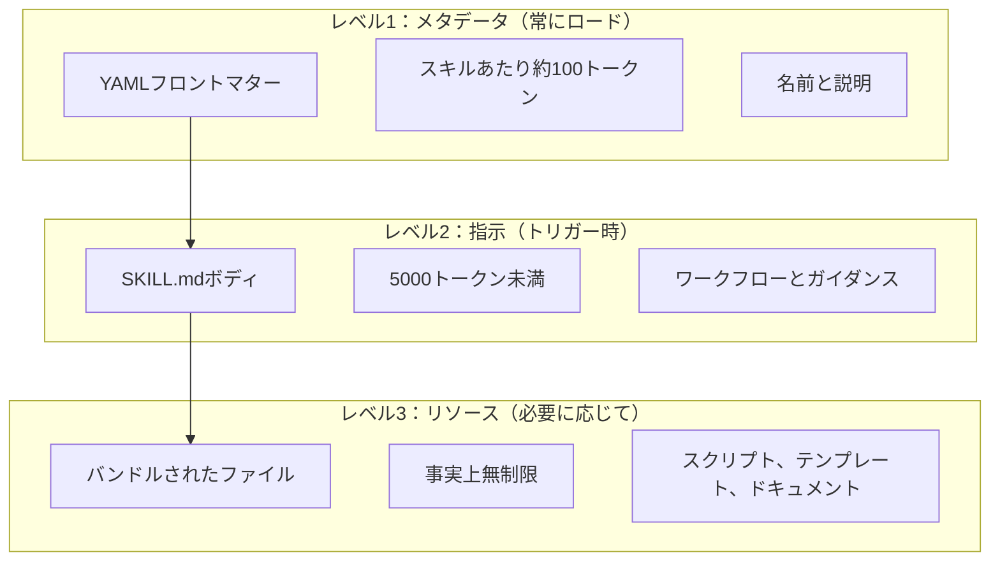
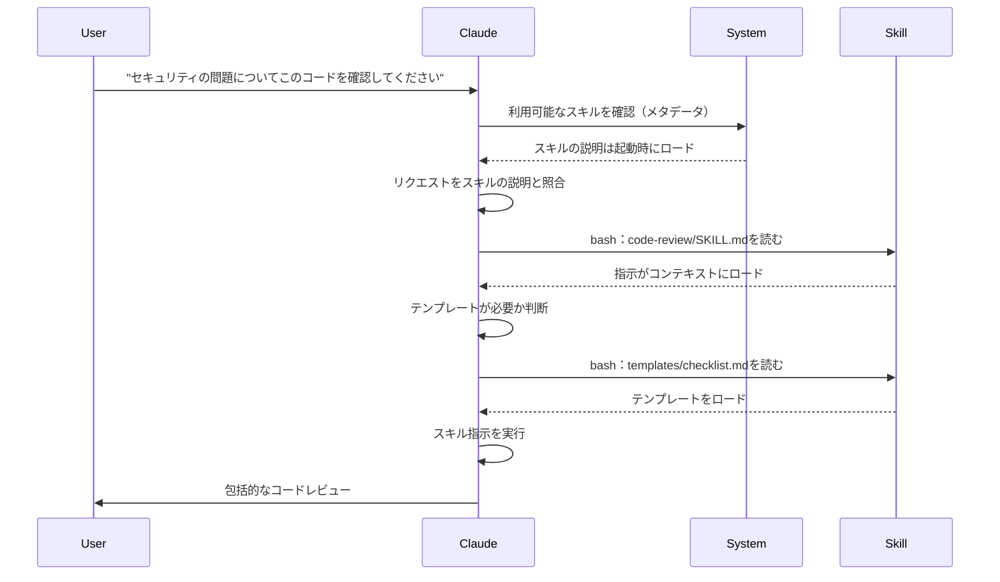

<picture>
  <source media="(prefers-color-scheme: dark)" srcset="../resources/logos/claude-howto-logo-dark.svg">
  
</picture>

# エージェント スキル ガイド

エージェント スキルは再利用可能なファイルシステム ベースの機能で、Claudeの機能を拡張します。ドメイン固有の専門知識、ワークフロー、ベストプラクティスを発見可能なコンポーネントにパッケージング し、Claudeが関連する際に自動的に使用します。

## 概要

**エージェント スキル** は、汎用エージェントを専門家に変換するモジュール機能です。プロンプト（1回限りのタスク用の会話レベルの指示）とは異なり、スキルはオンデマンドで読み込まれ、複数の会話で同じガイダンスを何度も提供する必要がなくなります。

### 主な利点

- **Claudeを特殊化**: ドメイン固有のタスク用の機能をカスタマイズします
- **繰り返しを削減**: 一度作成すれば、会話全体で自動的に再利用できます
- **機能を構成**: スキルを組み合わせて複雑なワークフローを構築します
- **ワークフローをスケール**: 複数のプロジェクトとチーム全体でスキルを再利用できます
- **品質を維持**: ベストプラクティスをワークフローに直接組み込みます

スキルは[Agent Skills](https://agentskills.io)オープン標準に従い、複数のAIツール間で機能します。Claude Codeは、呼び出しコントロール、サブエージェント実行、動的コンテキスト注入などの追加機能で標準を拡張します。

> **注**: カスタム スラッシュ コマンドはスキルにマージされました。`.claude/commands/` ファイルは引き続き機能し、同じフロントマター フィールドをサポートします。新規開発にはスキルが推奨されます。同じパスに両方が存在する場合（例：`.claude/commands/review.md` と `.claude/skills/review/SKILL.md`）、スキルが優先されます。

## スキルのしくみ：プログレッシブディスクロージャー

スキルは**プログレッシブディスクロージャー**アーキテクチャを活用し、必要に応じて段階的に情報を読み込みます。コンテキストを事前に消費するのではなく、効率的なコンテキスト管理を実現しながら無制限のスケーラビリティを維持します。

### 3つのロード レベル



| レベル | ロード時期 | トークンコスト | コンテンツ |
|-------|------------|------------|---------|
| **レベル1：メタデータ** | 常に（起動時） | スキルあたり約100トークン | YAMLフロントマターの `name` と `description` |
| **レベル2：指示** | スキルがトリガーされたとき | 5000トークン未満 | 指示とガイダンス付きのSKILL.mdボディ |
| **レベル3以上：リソース** | 必要に応じて | 事実上無制限 | コンテキストにコンテンツをロードせずにbashで実行されるバンドルされたファイル |

これは、多くのスキルをインストールしてもコンテキスト ペナルティなしで実行でき、Claudeは各スキルが存在し、いつ使用するかを知っているだけで、実際にトリガーされるまで知らないということを意味します。

## スキル ロード プロセス



## スキルタイプと場所

| タイプ | 場所 | スコープ | 共有 | 最適な用途 |
|------|----------|-------|--------|----------|
| **エンタープライズ** | 管理設定 | すべての組織ユーザー | はい | 組織全体の標準 |
| **個人** | `~/.claude/skills/<skill-name>/SKILL.md` | 個人 | いいえ | 個人のワークフロー |
| **プロジェクト** | `.claude/skills/<skill-name>/SKILL.md` | チーム | はい（git経由） | チームの標準 |
| **プラグイン** | `<plugin>/skills/<skill-name>/SKILL.md` | 有効化されている場所 | 異なる場合がある | プラグインと一緒にバンドル |

スキルが複数レベルで同じ名前を共有する場合、より高い優先度の場所が優先されます：**エンタープライズ > 個人 > プロジェクト**。プラグイン スキルは `plugin-name:skill-name` ネームスペースを使用するため、競合が発生しません。

### 自動検出

**ネストされたディレクトリ**: サブディレクトリ内のファイルを操作する場合、Claude Code は自動的にネストされた `.claude/skills/` ディレクトリからスキルを検出します。例えば、`packages/frontend/` 内のファイルを編集している場合、Claude Code は `packages/frontend/.claude/skills/` でもスキルを探します。これはモノレポのセットアップをサポートします。ここで各パッケージは独自のスキルを持つことができます。

**`--add-dir` ディレクトリ**: `--add-dir` を介して追加されたディレクトリのスキルは、ライブ変更検出で自動的にロードされます。これらのディレクトリ内のスキル ファイルへの編集は、Claude Code を再起動せずにすぐに有効になります。

**説明予算**: スキル説明（レベル1メタデータ）はコンテキスト ウィンドウの **1%** に制限されています（フォールバック：**8,000文字**）。多くのスキルがインストールされている場合、説明が短縮される可能性があります。すべてのスキル名は常に含まれていますが、説明は収まるようにトリミングされます。説明の主な使用例を最初に配置します。`SLASH_COMMAND_TOOL_CHAR_BUDGET` 環境変数で予算をオーバーライドします。

## カスタム スキルを作成する

### 基本的なディレクトリ構造

```
my-skill/
├── SKILL.md           # 主な指示（必須）
├── template.md        # Claudeが入力するテンプレート
├── examples/
│   └── sample.md      # 期待される形式を示す出力例
└── scripts/
    └── validate.sh    # Claudeが実行できるスクリプト
```

### SKILL.mdフォーマット

```yaml
---
name: your-skill-name
description: このスキルが実行する内容と使用する時期の簡単な説明
---

# スキル名

## 指示
Claudeのための明確でステップバイステップのガイダンスを提供します。

## 例
このスキルの使用の具体的な例を表示します。
```

### 必須フィールド

- **name**: 小文字、数字、ハイフンのみ（最大64文字）。「anthropic」または「claude」を含めることはできません。
- **description**: スキルが実行する内容と使用する時期（最大1024文字）。Claudeがスキルをアクティブ化するかどうかを知るために重要です。

### オプションのフロントマター フィールド

```yaml
---
name: my-skill
description: このスキルが実行する内容と使用する時期
argument-hint: "[filename] [format]"        # 自動補完のヒント
disable-model-invocation: true              # ユーザーのみが呼び出し可能
user-invocable: false                       # スラッシュ メニューから非表示
allowed-tools: Read, Grep, Glob             # ツール アクセスを制限
model: opus                                 # 使用する特定モデル
effort: high                                # 努力レベルオーバーライド（低、中、高、最大）
context: fork                               # 分離されたサブエージェントで実行
agent: Explore                              # エージェント タイプ（context: fork付き）
shell: bash                                 # コマンド用のシェル：bash（デフォルト）またはpowershell
hooks:                                      # スキル スコープのフック
  PreToolUse:
    - matcher: "Bash"
      hooks:
        - type: command
          command: "./scripts/validate.sh"
paths: "src/api/**/*.ts"               # スキルがアクティブ化される時期を制限するグロブパターン
---
```

| フィールド | 説明 |
|-------|-------------|
| `name` | 小文字、数字、ハイフンのみ（最大64文字）。「anthropic」または「claude」を含めることはできません。 |
| `description` | このスキルが実行する内容と使用する時期（最大1024文字）。自動呼び出しマッチングに重要です。 |
| `argument-hint` | `/` オートコンプリート メニューに表示されるヒント（例：`"[filename] [format]"`）。 |
| `disable-model-invocation` | `true` = ユーザーのみが `/name` 経由で呼び出すことができます。Claude は自動呼び出ししません。 |
| `user-invocable` | `false` = `/` メニューから非表示。Claude のみが自動的に呼び出すことができます。 |
| `allowed-tools` | スキルがパーミッション プロンプトなしで使用できるツールのカンマ区切りリスト。 |
| `model` | スキルがアクティブな間のモデル オーバーライド（例：`opus`、`sonnet`）。 |
| `effort` | スキルがアクティブな間の努力レベル オーバーライド：`low`、`medium`、`high`、または `max`。 |
| `context` | フォークされたサブエージェント コンテキストで実行するには `fork` を設定します。 |
| `agent` | `context: fork` の場合のサブエージェント タイプ（例：`Explore`、`Plan`、`general-purpose`）。 |
| `shell` | `!`command`` 置換およびスクリプトに使用されるシェル：`bash`（デフォルト）または `powershell`。 |
| `hooks` | このスキルのライフサイクルにスコープされたフック（グローバル フックと同じ形式）。 |
| `paths` | スキルの自動アクティブ化時期を制限するグロブパターン。カンマ区切りの文字列またはYAMLリスト。パス固有のルールと同じ形式。 |

## スキル コンテンツ タイプ

スキルには2つのタイプのコンテンツが含まれ、それぞれ異なる目的に適しています：

### リファレンス コンテンツ

Claudeが現在の作業に適用する知識を追加します。規則、パターン、スタイル ガイド、ドメイン知識。会話コンテキストにインラインで実行されます。

```yaml
---
name: api-conventions
description: このコードベースのAPIデザイン パターン
---

APIエンドポイントを記述する場合：
- RESTfulな命名規則を使用します
- 一貫したエラー形式を返す
- リクエスト検証を含める
```

### タスク コンテンツ

特定のアクション用のステップバイステップの指示。多くの場合、`/skill-name` で直接呼び出されます。

```yaml
---
name: deploy
description: アプリケーションを本番環境にデプロイする
context: fork
disable-model-invocation: true
---

アプリケーションをデプロイします：
1. テストスイートを実行します
2. アプリケーションをビルドします
3. デプロイメント ターゲットにプッシュします
```

## スキル呼び出しの制御

デフォルトでは、あなたとClaudeの両方がすべてのスキルを呼び出すことができます。2つのフロントマター フィールドが3つの呼び出しモードを制御します：

| フロントマター | あなたが呼び出せる | Claudeが呼び出せる |
|---|---|---|
| （デフォルト） | はい | はい |
| `disable-model-invocation: true` | はい | いいえ |
| `user-invocable: false` | いいえ | はい |

**副作用のあるワークフローには `disable-model-invocation: true` を使用してください**：`/commit`、`/deploy`、`/send-slack-message`。コードが準備完了しているように見えるため、Claudeがデプロイすることはできません。

**背景知識には `user-invocable: false` を使用してください**。アクション可能ではありません。`legacy-system-context` スキルは古いシステムがどのように機能するかを説明します。Claudeに役立ちますが、ユーザーにとって意味のあるアクションではありません。

## 文字列置換

スキルはスキル コンテンツがClaudeに到達する前に解決される動的値をサポートします：

| 変数 | 説明 |
|----------|-------------|
| `$ARGUMENTS` | スキル呼び出し時に渡されたすべての引数 |
| `$ARGUMENTS[N]` または `$N` | インデックス（0ベース）で特定の引数にアクセス |
| `${CLAUDE_SESSION_ID}` | 現在のセッションID |
| `${CLAUDE_SKILL_DIR}` | スキルのSKILL.mdファイルを含むディレクトリ |
| `` !`command` `` | 動的コンテキスト注入 — シェル コマンドを実行して出力をインライン化 |

**例：**

```yaml
---
name: fix-issue
description: GitHubの問題を修正する
---

$ARGUMENTS に従ってGitHubの問題を修正します：
1. 問題の説明を読む
2. 修正を実装する
3. テストを作成する
4. コミットを作成する
```

`/fix-issue 123` を実行すると、`$ARGUMENTS` が `123` に置き換わります。

## 動的コンテキストの注入

`` !`command` `` 構文はスキル コンテンツがClaudeに送信される前にシェル コマンドを実行します：

```yaml
---
name: pr-summary
description: プルリクエストの変更を要約する
context: fork
agent: Explore
---

## プルリクエスト コンテキスト
- PRのdiff：!`gh pr diff`
- PRのコメント：!`gh pr view --comments`
- 変更されたファイル：!`gh pr diff --name-only`

## あなたのタスク
このプルリクエストを要約してください...
```

コマンドは即座に実行されます。Claudeは最終的な出力のみを表示します。デフォルトではコマンドは `bash` で実行されます。フロントマターで `shell: powershell` を設定してPowerShellの代わりに使用します。

## サブエージェントでスキルを実行する

スキルを分離されたサブエージェント コンテキストで実行するには、`context: fork` を追加します。スキル コンテンツはメイン会話を整理されていない状態にしておくために、独自のコンテキスト ウィンドウを持つ専用サブエージェントのタスクになります。

`agent` フィールドはどのエージェント タイプを使用するかを指定します：

| エージェント タイプ | 最適な用途 |
|---|---|
| `Explore` | 読み取り専用の研究、コードベース分析 |
| `Plan` | 実装計画の作成 |
| `general-purpose` | すべてのツールが必要な幅広いタスク |
| カスタム エージェント | 構成で定義された専門エージェント |

**フロントマターの例：**

```yaml
---
context: fork
agent: Explore
---
```

**完全なスキルの例：**

```yaml
---
name: deep-research
description: トピックを徹底的に研究する
context: fork
agent: Explore
---

$ARGUMENTS を徹底的に研究します：
1. Globとgrepを使用して関連ファイルを見つける
2. コードを読んで分析する
3. 特定のファイル参照での調査結果をまとめる
```

## 実用的な例

### 例1：コード レビュー スキル

**ディレクトリ構造：**

```
~/.claude/skills/code-review/
├── SKILL.md
├── templates/
│   ├── review-checklist.md
│   └── finding-template.md
└── scripts/
    ├── analyze-metrics.py
    └── compare-complexity.py
```

**ファイル：** `~/.claude/skills/code-review/SKILL.md`

```yaml
---
name: code-review-specialist
description: セキュリティ、パフォーマンス、品質分析に焦点を当てた包括的なコード レビュー。ユーザーがコードを確認するように求める場合、コード品質を分析する場合、プルリクエストを評価する場合、またはコード レビュー、セキュリティ分析、またはパフォーマンス最適化を言及する場合に使用します。
---

# コード レビュー スキル

このスキルは、以下に焦点を当てた包括的なコード レビュー機能を提供します：

1. **セキュリティ分析**
   - 認証/承認の問題
   - データ露出リスク
   - インジェクション脆弱性
   - 暗号化の弱さ

2. **パフォーマンス レビュー**
   - アルゴリズム効率（ビッグO分析）
   - メモリ最適化
   - データベース クエリ最適化
   - キャッシング機会

3. **コード品質**
   - SOLID原則
   - デザイン パターン
   - 命名規則
   - テスト カバレッジ

4. **保守性**
   - コード可読性
   - 関数サイズ（50行未満である必要があります）
   - 循環的複雑度
   - 依存性管理

## レビュー テンプレート

レビューされたコードごとに、以下を提供します：

### サマリー
- 全体的な品質評価（1-5）
- 主な検出数
- 推奨される優先領域

### クリティカルな問題（ある場合）
- **問題**: 明確な説明
- **場所**: ファイルと行番号
- **影響**: これが重要な理由
- **重大度**: Critical/High/Medium
- **修正**: コード例

詳細なチェックリストについては、[templates/review-checklist.md](templates/review-checklist.md) を参照してください。
```

### 例2：コードベース ビジュアライザー スキル

インタラクティブなHTML ビジュアライゼーションを生成するスキル：

**ディレクトリ構造：**

```
~/.claude/skills/codebase-visualizer/
├── SKILL.md
└── scripts/
    └── visualize.py
```

**ファイル：** `~/.claude/skills/codebase-visualizer/SKILL.md`

````yaml
---
name: codebase-visualizer
description: コードベースのインタラクティブで折りたたみ可能なツリー ビジュアライゼーションを生成します。新しいレポを探索するとき、プロジェクト構造を理解するとき、または大きなファイルを識別するときに使用します。
allowed-tools: Bash(python *)
---

# コードベース ビジュアライザー

プロジェクトのファイル構造を表示するインタラクティブなHTMLツリー ビューを生成します。

## 使用方法

プロジェクト ルートからビジュアライゼーション スクリプトを実行します：

```bash
python ~/.claude/skills/codebase-visualizer/scripts/visualize.py .
```

これにより、`codebase-map.html` が作成され、デフォルトのブラウザーで開きます。

## ビジュアライゼーションが表示するもの

- **折りたたみ可能なディレクトリ**: フォルダをクリックして展開/折りたたむ
- **ファイル サイズ**: 各ファイルの横に表示
- **色**: ファイル タイプが異なる色で表示
- **ディレクトリ合計**: 各フォルダの集計サイズを表示
````

バンドルされたPythonスクリプトはオーケストレーションを処理しながら重い作業を行います。

### 例3：デプロイ スキル（ユーザーが呼び出すのみ）

```yaml
---
name: deploy
description: アプリケーションを本番環境にデプロイする
disable-model-invocation: true
allowed-tools: Bash(npm *), Bash(git *)
---

$ARGUMENTS を本番環境にデプロイします：

1. テストスイートを実行します：`npm test`
2. アプリケーションをビルドします：`npm run build`
3. デプロイメント ターゲットにプッシュします
4. デプロイメントが成功したことを確認します
5. デプロイメント ステータスをレポートします
```

### 例4：ブランド ボイス スキル（背景知識）

```yaml
---
name: brand-voice
description: すべての通信がブランド ボイスとトーン ガイドラインと一致していることを確認します。マーケティング コピー、顧客通信、または公開コンテンツを作成する場合に使用します。
user-invocable: false
---

## 声のトーン
- **親切だが専門的** - アクセス可能だが非カジュアル
- **明確で簡潔** - 専門用語を避ける
- **自信のある** - 私たちが何をしているかを知っています
- **共感的** - ユーザーのニーズを理解する

## 執筆ガイドライン
- 読者に対応するときに「あなた」を使用します
- 能動態を使用する
- 文を20語未満に保つ
- バリュー プロポジションで開始する

テンプレートについては、[templates/](templates/) を参照してください。
```

### 例5：CLAUDE.mdジェネレーター スキル

```yaml
---
name: claude-md
description: 最適なAIエージェント オンボーディングのためのベストプラクティスに従って、CLAUDE.mdファイルを作成または更新します。ユーザーがCLAUDE.md、プロジェクト ドキュメンテーション、またはAIオンボーディングについて言及する場合に使用します。
---

## コア原則

**LLMはステートレスです**：CLAUDE.mdは、すべての会話に自動的に含まれる唯一のファイルです。

### 黄金のルール

1. **簡潔性優先**：フロンティア LLMは約150～200の指示に従うことができます。Claude Codeのシステム プロンプトは既に約50を使用しています。CLAUDE.mdを焦点を絞った簡潔なものに保ちます。

2. **普遍的な適用性**：すべてのセッションに関連する情報のみを含めてください。タスク固有の指示は別のファイルに属します。

3. **Claudeをリンターとして使用しないでください**：スタイル ガイドラインはコンテキストを膨らませ、指示を遵守する機能を低下させます。代わりに決定論的なツール（prettier、eslint など）を使用してください。

4. **自動生成しないでください**：CLAUDE.mdはAIハーネスの最高レベルのポイントです。注意深く検討して手動で作成します。

## 重要なセクション

- **プロジェクト名**：簡潔な1行の説明
- **テック スタック**：主言語、フレームワーク、データベース
- **開発コマンド**：インストール、テスト、ビルド コマンド
- **重要な規則**：非明白で高影響力の規則のみ
- **既知の問題/落とし穴**：開発者を困らせる傾向があるもの
```

### 例6：スクリプト付きリファクタリング スキル

**ディレクトリ構造：**

```
refactor/
├── SKILL.md
├── references/
│   ├── code-smells.md
│   └── refactoring-catalog.md
├── templates/
│   └── refactoring-plan.md
└── scripts/
    ├── analyze-complexity.py
    └── detect-smells.py
```

**ファイル：** `refactor/SKILL.md`

```yaml
---
name: code-refactor
description: Martin Fowlerの方法論に基づいた体系的なコード リファクタリング。ユーザーがコードをリファクタリングするように求める場合、コード構造を改善する場合、技術負債を削減する場合、または技術的負債を排除するように求める場合に使用します。このスキルは、安全な増分実装を伴う研究、計画、および段階的なアプローチをガイドします。
---

# コード リファクタリング スキル

Martin Fowlerの *Refactoring: Improving the Design of Existing Code*（第2版）に基づいた体系的なアプローチ。このスキルは、テストに支援された安全で増分的な変更を強調しています。

> 「リファクタリングは、コードの外部動作を変更せずにソフトウェア システムを変更するプロセスです。」— Martin Fowler

## コア原則

1. **動作保存**：外部動作は変更されたままである必要があります
2. **小さなステップ**：小さく、テスト可能な変更を行う
3. **テスト駆動**：テストは安全ネット
4. **継続的**：リファクタリングは1回限りのイベントではなく、進行中です
5. **協調的**：各段階でユーザーの承認が必要

フェーズを参照してください...（詳細は英語版と同じロジックに従います）
```

## サポート ファイル

スキルは `SKILL.md` を超えて、ディレクトリにさまざまなファイルを含めることができます。これらのサポート ファイル（テンプレート、例、スクリプト、リファレンス ドキュメント）により、メイン スキル ファイルを焦点を絞ったままにしながら、Claudeに追加リソースを提供できます。

```
my-skill/
├── SKILL.md              # 主な指示（必須、500行以下に保つ）
├── templates/            # Claudeが入力するテンプレート
│   └── output-format.md
├── examples/             # 期待される形式を示す出力例
│   └── sample-output.md
├── references/           # ドメイン知識と仕様
│   └── api-spec.md
└── scripts/              # Claudeが実行できるスクリプト
    └── validate.sh
```

サポート ファイルのガイドライン：

- `SKILL.md` を**500行以下**に保ちます。詳細なリファレンス資料、大きな例、仕様を別のファイルに移動します。
- `SKILL.md` から**相対パス**を使用してサポート ファイルを参照します（例：`[APIリファレンス](references/api-spec.md)`）。
- サポート ファイルはレベル3（必要に応じて）でロードされるため、Claudeが実際に読み取るまでコンテキストを消費しません。

## スキルの管理

### 利用可能なスキルの表示

Claudeに直接尋ねます：
```
どのスキルが利用可能ですか？
```

またはファイルシステムを確認します：
```bash
# 個人スキルのリスト
ls ~/.claude/skills/

# プロジェクト スキルのリスト
ls .claude/skills/
```

### スキルのテスト

2つの方法でテストできます：

**Claudeに自動的に呼び出させる** スキルの説明と一致する質問をすることで：
```
コードのセキュリティ上の問題を確認するのに役立つことができますか？
```

**または スキル名で直接呼び出します**：
```
/code-review src/auth/login.ts
```

### スキルを更新する

`SKILL.md` ファイルを直接編集します。変更は次のClaude Code起動時に有効になります。

```bash
# 個人スキル
code ~/.claude/skills/my-skill/SKILL.md

# プロジェクト スキル
code .claude/skills/my-skill/SKILL.md
```

### Claudeのスキル アクセスを制限する

スキル呼び出しを制御する3つの方法：

**`/permissions` ですべてのスキルを無効にする**：
```
拒否規則に追加：
Skill
```

**特定のスキルを許可または拒否する**：
```
# 特定のスキルのみを許可
Skill(commit)
Skill(review-pr *)

# 特定のスキルを拒否
Skill(deploy *)
```

**フロントマターに `disable-model-invocation: true` を追加してスキルを非表示にする**。

## ベストプラクティス

### 1. 説明を具体的にする

- **悪い（曖昧）**: 「ドキュメントの手助け」
- **良い（具体的）**: 「PDFファイルからテキストと表を抽出し、フォームに入力し、ドキュメントをマージします。PDFファイル、フォーム、またはドキュメント抽出についてユーザーが言及する場合、またはPDFファイルを使用する場合に使用します。」

### 2. スキルを焦点を絞った状態に保つ

- 1つのスキル = 1つの機能
- ✅ 「PDFフォーム記入」
- ❌ 「ドキュメント処理」（範囲が広すぎる）

### 3. トリガー用語を含める

説明にキーワードを追加して、ユーザーリクエストと一致させます：
```yaml
description: Excelスプレッドシートを分析し、ピボット テーブルを生成し、グラフを作成します。Excelファイル、スプレッドシート、または.xlsxファイルを使用する場合に使用します。
```

### 4. SKILL.md を500行以下に保つ

詳細なリファレンス資料を別のファイルに移動して、Claudeが必要に応じてロードします。

### 5. サポート ファイルを参照する

```markdown
## 追加リソース

- 完全なAPI詳細については、[reference.md](reference.md) を参照してください
- 使用例については、[examples.md](examples.md) を参照してください
```

### すべきこと

- 明確でわかりやすい名前を使用する
- 包括的な指示を含める
- 具体的な例を追加する
- 関連スクリプトとテンプレートをパッケージ化する
- 実際のシナリオでテストする
- 依存関係をドキュメント化する

### すべきではないこと

- 1回限りのタスク用のスキルを作成しない
- 既存の機能を複製しない
- スキルを広すぎるようにしない
- 説明フィールドをスキップしない
- 信頼されていないソースからのスキルをインストールしない検査のみ

## トラブルシューティング

### クイック リファレンス

| 問題 | 解決方法 |
|-------|----------|
| Claudeがスキルを使用しない | より具体的なトリガー用語で説明を作成する |
| スキル ファイルが見つからない | パスを確認：`~/.claude/skills/name/SKILL.md` |
| YAMLエラー | `---` マーカー、インデンテーション、タブなしを確認します |
| スキルの競合 | 説明で異なるトリガー用語を使用する |
| スクリプトが実行されない | パーミッションを確認：`chmod +x scripts/*.py` |
| Claudeがすべてのスキルを見ない | スキルが多すぎます。`/context` で警告を確認します |

### スキルがトリガーされない

Claudeがスキルを期待する場合に使用しない場合：

1. 説明にユーザーが自然に言うキーワードが含まれていることを確認します
2. 「どのスキルが利用可能ですか？」と尋ねるときにスキルが表示されることを確認します
3. リクエストを説明と一致させるために言い換えてみてください
4. `/skill-name` で直接呼び出してテストしてください

### スキルが頻繁にトリガーされる

Claudeがスキルを期待していないときに使用する場合：

1. 説明をより具体的にする
2. 手動のみの呼び出しのために `disable-model-invocation: true` を追加する

### Claudeがすべてのスキルを表示しない

スキル説明はコンテキスト ウィンドウの **1%** でロードされます（フォールバック：**8,000文字**）。各エントリは予算に関係なく250文字に制限されます。すべてのスキル名は常に含まれていますが、説明は範囲内に収まるようにトリミングされます。実行 `/context` 除外されたスキルに関する警告を確認します。`SLASH_COMMAND_TOOL_CHAR_BUDGET` 環境変数で予算をオーバーライドします。

## セキュリティに関する考慮事項

**信頼できるソースからのスキルのみを使用してください。** スキルは指示とコード経由でClaudeに機能を提供します。悪意のあるスキルは、有害な方法でツールを呼び出すまたはコードを実行するようにClaudeに指示できます。

**主なセキュリティ上の注意事項：**

- **徹底的に監査する**: スキル ディレクトリのすべてのファイルを確認します
- **外部ソースは危険です**: 外部URLからフェッチするスキルはセキュリティ侵害される可能性があります
- **ツールの誤用**: 悪意のあるスキルは有害な方法でツールを呼び出すことができます
- **ソフトウェアのインストールのように扱う**: 信頼できるソースからのスキルのみを使用します

## スキル対その他の機能

| 機能 | 呼び出し | 最適な用途 |
|---------|------------|----------|
| **スキル** | 自動または `/name` | 再利用可能な専門知識、ワークフロー |
| **スラッシュ コマンド** | ユーザーが開始した `/name` | クイック ショートカット（スキルにマージ） |
| **サブエージェント** | 自動委譲 | 分離されたタスク実行 |
| **メモリ（CLAUDE.md）** | 常にロード | 永続的なプロジェクト コンテキスト |
| **MCP** | リアルタイム | 外部データ/サービス アクセス |
| **フック** | イベント駆動 | 自動化された副作用 |

## バンドルされたスキル

Claude Codeは、インストールなしで常に利用可能なビルト インスキルが付属しています：

| スキル | 説明 |
|-------|-------------|
| `/simplify` | 変更されたファイルを再利用、品質、効率について確認します。3つの並列レビュー エージェントを生成します |
| `/batch <instruction>` | gitworktreeを使用してコードベース全体で大規模な並列変更をオーケストレーションします |
| `/debug [description]` | デバッグ ログを読んで現在のセッションをトラブルシューティングしてください |
| `/loop [interval] <prompt>` | 間隔でプロンプトを繰り返し実行します（例：`/loop 5m check the deploy`） |
| `/claude-api` | Claude API/SDKリファレンスをロードします。`anthropic`/`@anthropic-ai/sdk` インポート時に自動アクティブ化 |

これらのスキルはボックスの外で利用可能で、インストールまたは構成は不要です。カスタム スキルと同じSKILL.md形式に従います。

## スキルの共有

### プロジェクト スキル（チーム共有）

1. `.claude/skills/` でスキルを作成する
2. gitにコミット
3. チーム メンバーが変更をプルします — スキルはすぐに利用可能になります

### 個人スキル

```bash
# 個人ディレクトリにコピー
cp -r my-skill ~/.claude/skills/

# スクリプトを実行可能にする
chmod +x ~/.claude/skills/my-skill/scripts/*.py
```

### プラグイン配布

スキルをより広く配布するためにプラグインの `skills/` ディレクトリに入れてください。

## さらに進める：スキル コレクションとスキル マネージャー

スキルを本気で構築し始めると、2つのことが不可欠になります：実証済みのスキル ライブラリと、スキルを管理するツール。

**[luongnv89/skills](https://github.com/luongnv89/skills)** — ほぼすべてのプロジェクトで毎日使用するスキルのコレクション。ハイライトには、`logo-designer`（オンザフライでプロジェクト ロゴを生成）と `ollama-optimizer`（ハードウェア用のローカルLLMパフォーマンスをチューニング）が含まれます。すぐに使用できるスキルが必要な場合は、素晴らしい出発点です。

**[luongnv89/asm](https://github.com/luongnv89/asm)** — エージェント スキル マネージャー。スキル開発、重複検出、テストを処理します。`asm link` コマンドを使用すると、ファイルをコピーすることなく、任意のプロジェクトでスキルをテストできます。複数のスキルを持つようになったら不可欠です。

## 追加リソース

- [公式スキル ドキュメンテーション](https://code.claude.com/docs/en/skills)
- [エージェント スキル アーキテクチャ ブログ](https://claude.com/blog/equipping-agents-for-the-real-world-with-agent-skills)
- [スキル リポジトリ](https://github.com/luongnv89/skills) - すぐに使用できるスキルのコレクション
- [スラッシュ コマンド ガイド](../01-slash-commands/) - ユーザーが開始したショートカット
- [サブエージェント ガイド](../04-subagents/) - 委譲されたAIエージェント
- [メモリ ガイド](../02-memory/) - 永続的なコンテキスト
- [MCP（モデル コンテキスト プロトコル）](../05-mcp/) - リアルタイム外部データ
- [フック ガイド](../06-hooks/) - イベント駆動の自動化

---
**最終更新**：2026年4月9日
**Claude Codeバージョン**：2.1.97
**互換性のあるモデル**：Claude Sonnet 4.6、Claude Opus 4.6、Claude Haiku 4.5
