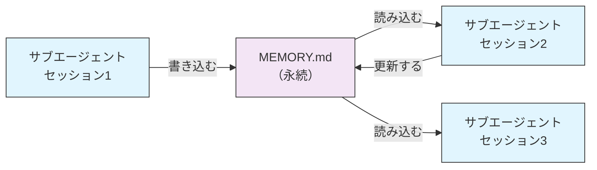
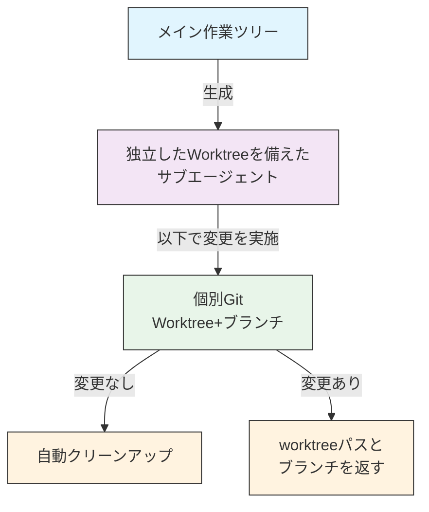
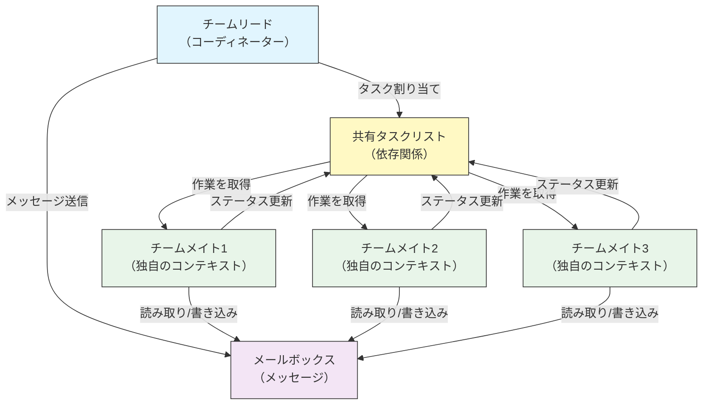
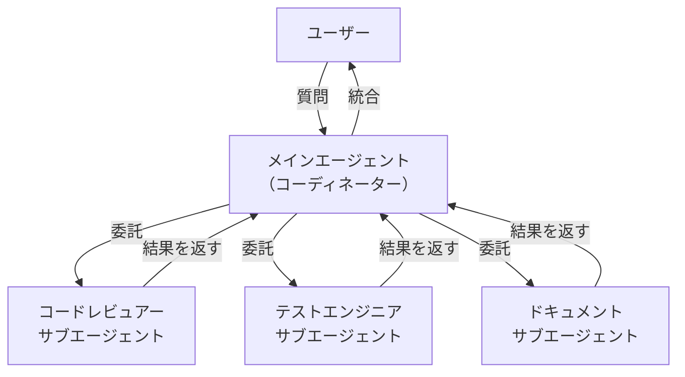
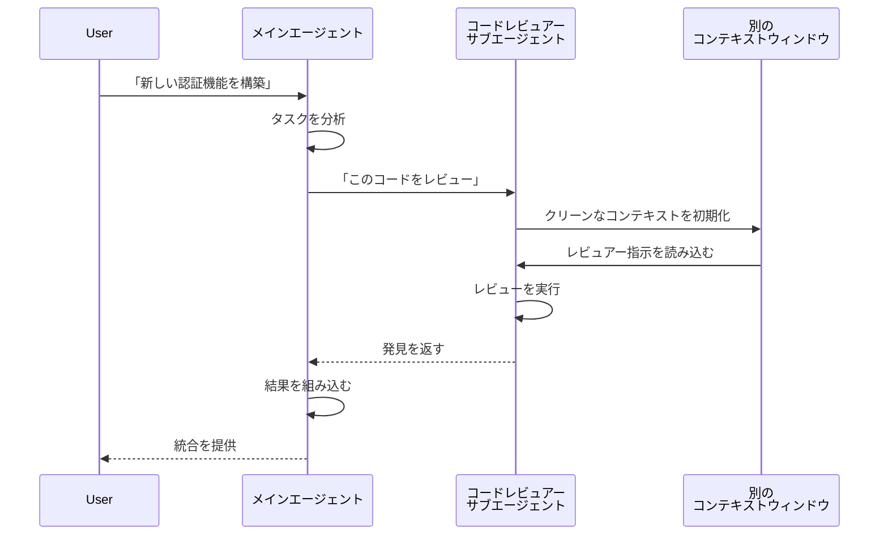
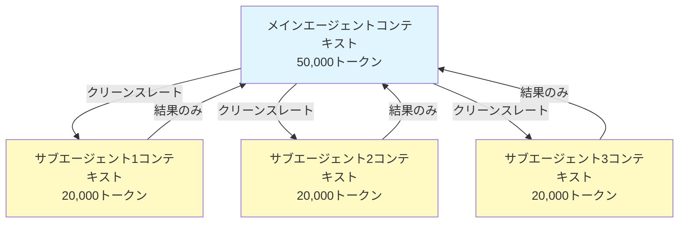
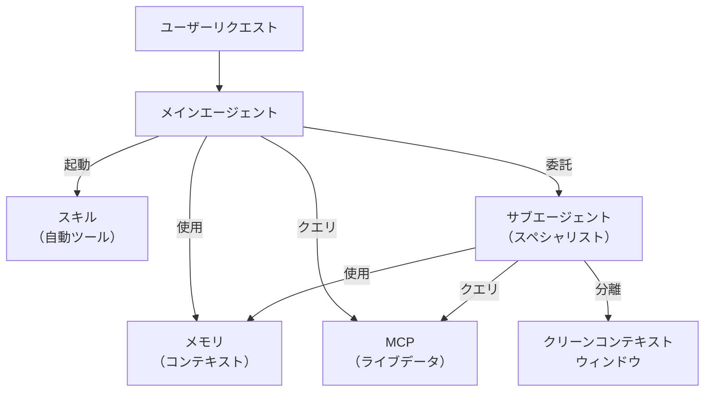

<picture>
  <source media="(prefers-color-scheme: dark)" srcset="../resources/logos/claude-howto-logo-dark.svg">
  
</picture>

# サブエージェント - 完全リファレンスガイド

サブエージェントは、Claude Codeが委託できる特化したAIアシスタントです。各サブエージェントは特定の目的を持ち、メイン会話とは別の独自のコンテキストウィンドウを使用し、特定のツールとカスタムシステムプロンプトで設定できます。

## 目次

1. [概要](#概要)
2. [主要な利点](#主要な利点)
3. [ファイルの場所](#ファイルの場所)
4. [設定](#設定)
5. [組み込みサブエージェント](#組み込みサブエージェント)
6. [サブエージェントの管理](#サブエージェントの管理)
7. [サブエージェントの使用](#サブエージェントの使用)
8. [再開可能エージェント](#再開可能エージェント)
9. [サブエージェントのチェーン](#サブエージェントのチェーン)
10. [サブエージェント用の永続的メモリ](#サブエージェント用の永続的メモリ)
11. [バックグラウンドサブエージェント](#バックグラウンドサブエージェント)
12. [Worktreeの分離](#Worktreeの分離)
13. [生成可能なサブエージェントを制限](#生成可能なサブエージェントを制限)
14. [`claude agents` CLIコマンド](#claude-agents-cliコマンド)
15. [エージェントチーム（実験的）](#エージェントチーム実験的)
16. [プラグインサブエージェントセキュリティ](#プラグインサブエージェントセキュリティ)
17. [アーキテクチャ](#アーキテクチャ)
18. [コンテキスト管理](#コンテキスト管理)
19. [サブエージェントいつ使用](#サブエージェントいつ使用)
20. [ベストプラクティス](#ベストプラクティス)
21. [このフォルダ内のサブエージェント例](#このフォルダ内のサブエージェント例)
22. [インストール手順](#インストール手順)
23. [関連概念](#関連概念)

---

## 概要

サブエージェントは、Claude Codeで委託されたタスク実行を有効にします：

- **分離されたAIアシスタント**を作成する、独立したコンテキストウィンドウを備えて
- **カスタマイズされたシステムプロンプト**を提供して、特化した専門知識用
- **ツールアクセス制御**を強制して、機能を制限
- **コンテキスト汚染**を防止して、複雑なタスクから
- **複数の特化したタスク**の**並列実行**を有効化

各サブエージェントはクリーンスレートで独立して動作し、特定のタスク用に必要な特定のコンテキストのみを受け取り、結果をメインエージェントに返します。

**クイックスタート**: `/agents`コマンドを使用して、対話的にサブエージェントを作成、表示、編集、管理します。

---

## 主要な利点

| 利点 | 説明 |
|---------|-------------|
| **コンテキスト保護** | 分離されたコンテキストで動作し、メイン会話の汚染を防止 |
| **特化した専門知識** | ドメイン特有に調整され、より高い成功率 |
| **再利用性** | 異なるプロジェクト全体で使用し、チームと共有 |
| **柔軟な権限** | 異なるサブエージェント種別用に異なるツールアクセスレベル |
| **スケーラビリティ** | 複数のエージェントが同時に異なる側面で機能 |

---

## ファイルの場所

サブエージェントファイルは、異なるスコープを持つ複数の場所に保存できます：

| 優先度 | 種類 | 場所 | スコープ |
|----------|------|----------|-------|
| 1（最高） | **CLI定義** | `--agents`フラグ（JSON）経由 | セッションのみ |
| 2 | **プロジェクトサブエージェント** | `.claude/agents/` | 現在のプロジェクト |
| 3 | **ユーザーサブエージェント** | `~/.claude/agents/` | すべてのプロジェクト |
| 4（最低） | **プラグインエージェント** | プラグイン `agents/`ディレクトリ | プラグイン経由 |

重複名が存在する場合、優先度の高いソースが優先されます。

---

## 設定

### ファイル形式

サブエージェントはYAMLフロントマターの後にマークダウンのシステムプロンプトで定義されます：

```yaml
---
name: your-sub-agent-name
description: このサブエージェントを起動すべき時期の説明
tools: tool1, tool2, tool3  # オプション - 省略された場合、すべてのツールを継承
disallowedTools: tool4  # オプション - 明示的に許可されていないツール
model: sonnet  # オプション - sonnet、opus、haiku、またはinherit
permissionMode: default  # オプション - 権限モード
maxTurns: 20  # オプション - エージェンティックターンを制限
skills: skill1, skill2  # オプション - コンテキストにプリロードするスキル
mcpServers: server1  # オプション - 利用可能にするMCPサーバー
memory: user  # オプション - 永続メモリスコープ（user、project、local）
background: false  # オプション - バックグラウンドタスクとして実行
effort: high  # オプション - 推論努力（low、medium、high、max）
isolation: worktree  # オプション - git worktree分離
initialPrompt: "コードベース分析から開始" # オプション - 自動送信第1ターン
hooks:  # オプション - コンポーネントスコープのフック
  PreToolUse:
    - matcher: "Bash"
      hooks:
        - type: command
          command: "./scripts/security-check.sh"
---

サブエージェントのシステムプロンプトがここに入ります。複数の段落を含むことができます
そして、サブエージェントの役割、機能、および問題解決への取り組みを明確に定義します。
```

### 設定フィールド

| フィールド | 必須 | 説明 |
|-------|----------|-------------|
| `name` | Yes | 一意の識別子（小文字と不連続符）|
| `description` | Yes | 目的の自然言語説明。「PROACTIVELY使用」を含めて自動起動を促進 |
| `tools` | No | コンマ区切りの特定ツール。すべてのツールを継承する場合は省略。`Agent(agent_name)`構文をサポートして、生成可能なサブエージェントを制限 |
| `disallowedTools` | No | サブエージェントが使用してはならないツールのコンマ区切りリスト |
| `model` | No | 使用するモデル：`sonnet`、`opus`、`haiku`、完全なモデルID、または`inherit`。デフォルトは設定されたサブエージェントモデル |
| `permissionMode` | No | `default`、`acceptEdits`、`dontAsk`、`bypassPermissions`、`plan` |
| `maxTurns` | No | サブエージェントが取得できるエージェンティックターンの最大数 |
| `skills` | No | プリロードするスキルのコンマ区切りリスト。完全なスキルコンテンツをサブエージェントのコンテキストに挿入 |
| `mcpServers` | No | サブエージェントで利用可能にするMCPサーバー |
| `hooks` | No | コンポーネントスコープのフック（PreToolUse、PostToolUse、Stop） |
| `memory` | No | 永続メモリディレクトリスコープ：`user`、`project`、または`local` |
| `background` | No | このサブエージェントを常にバックグラウンドタスクとして実行する場合は`true`に設定 |
| `effort` | No | 推論努力レベル：`low`、`medium`、`high`、または`max` |
| `isolation` | No | サブエージェントに独自のgit worktreeを与えるために`worktree`に設定 |
| `initialPrompt` | No | サブエージェントがメインエージェントとして実行するときに自動送信される第1ターン |

### ツール設定オプション

**オプション1：すべてのツールを継承（フィールドを省略）**
```yaml
---
name: full-access-agent
description: すべての利用可能なツールを備えたエージェント
---
```

**オプション2：個別ツールを指定**
```yaml
---
name: limited-agent
description: 特定のツールのみを備えたエージェント
tools: Read, Grep, Glob, Bash
---
```

**オプション3：条件付きツールアクセス**
```yaml
---
name: conditional-agent
description: フィルタリングされたツールアクセスを備えたエージェント
tools: Read, Bash(npm:*), Bash(test:*)
---
```

### CLI ベースの設定

`--agents`フラグでJSON形式を使用して、単一セッション用にサブエージェントを定義します：

```bash
claude --agents '{
  "code-reviewer": {
    "description": "エキスパートコードレビュアー。コード変更後に積極的に使用。",
    "prompt": "あなたはシニアコードレビュアーです。コード品質、セキュリティ、ベストプラクティスに焦点を当てます。",
    "tools": ["Read", "Grep", "Glob", "Bash"],
    "model": "sonnet"
  }
}'
```

**`--agents`フラグのJSON形式：**

```json
{
  "agent-name": {
    "description": "必須：このエージェントを起動すべき時期",
    "prompt": "必須：エージェント用のシステムプロンプト",
    "tools": ["オプション", "ツール", "配列"],
    "model": "オプション：sonnet|opus|haiku"
  }
}
```

**エージェント定義の優先度：**

エージェント定義は優先度順で読み込まれます（最初の一致が優先）：
1. **CLI定義** - `--agents`フラグ（セッションのみ、JSON）
2. **プロジェクトレベル** - `.claude/agents/`（現在のプロジェクト）
3. **ユーザーレベル** - `~/.claude/agents/`（すべてのプロジェクト）
4. **プラグインレベル** - プラグイン `agents/`ディレクトリ

これにより、CLI定義が単一セッション用にすべての他のソースをオーバーライドできます。

---

## 組み込みサブエージェント

Claude Codeには、常に利用可能ないくつかの組み込みサブエージェントが含まれています：

| エージェント | モデル | 目的 |
|-------|-------|---------|
| **general-purpose** | 継承 | 複雑なマルチステップタスク |
| **Plan** | 継承 | 計画モード用の研究 |
| **Explore** | Haiku | 読み取り専用コードベース探索（quick/medium/very thorough） |
| **Bash** | 継承 | 別のコンテキストのターミナルコマンド |
| **statusline-setup** | Sonnet | ステータスラインを設定 |
| **Claude Code Guide** | Haiku | Claude Code機能に関する質問に答える |

### 汎用サブエージェント

| プロパティ | 値 |
|----------|-------|
| **モデル** | 親から継承 |
| **ツール** | すべてのツール |
| **目的** | 複雑な研究タスク、マルチステップの操作、コード修正 |

**使用時**: 複雑な推論を用いた探索と修正の両方が必要なタスク。

### Plan サブエージェント

| プロパティ | 値 |
|----------|-------|
| **モデル** | 親から継承 |
| **ツール** | Read、Glob、Grep、Bash |
| **目的** | 計画モードで自動的に使用されてコードベースを研究 |

**使用時**: Claudeが計画を提示する前にコードベースを理解する必要があるとき。

### Explore サブエージェント

| プロパティ | 値 |
|----------|-------|
| **モデル** | Haiku（高速、低レイテンシ） |
| **モード** | 厳密に読み取り専用 |
| **ツール** | Glob、Grep、Read、Bash（読み取り専用コマンドのみ） |
| **目的** | 高速なコードベース検索と分析 |

**使用時**: 変更なしにコードを検索/理解する場合。

**詳細度レベル** - 探索の深さを指定：
- **"quick"** - 高速検索、最小限の探索、特定のパターン検索に適している
- **"medium"** - 適度な探索、速度と完全性のバランス、デフォルトのアプローチ
- **"very thorough"** - 複数の場所と命名規約全体の包括的な分析、より長くかかる可能性あり

### Bash サブエージェント

| プロパティ | 値 |
|----------|-------|
| **モデル** | 親から継承 |
| **ツール** | Bash |
| **目的** | 別のコンテキストウィンドウでターミナルコマンドを実行 |

**使用時**: 分離されたコンテキストから恩恵を受けるシェルコマンドを実行する場合。

### Statusline Setup サブエージェント

| プロパティ | 値 |
|----------|-------|
| **モデル** | Sonnet |
| **ツール** | Read、Write、Bash |
| **目的** | Claude Codeステータスラインディスプレイを設定 |

**使用時**: ステータスラインを設定またはカスタマイズする場合。

### Claude Code Guide サブエージェント

| プロパティ | 値 |
|----------|-------|
| **モデル** | Haiku（高速、低レイテンシ） |
| **ツール** | 読み取り専用 |
| **目的** | Claude Code機能と使用法に関する質問に答える |

**使用時**: ユーザーがClaude Codeの機能の使用方法に関する質問をしたとき。

---

## サブエージェントの管理

### `/agents`コマンドを使用（推奨）

```bash
/agents
```

これは対話的なメニューを提供します：
- すべての利用可能なサブエージェントを表示（組み込み、ユーザー、プロジェクト）
- ガイド付きセットアップで新しいサブエージェントを作成
- 既存のカスタムサブエージェントとツールアクセスを編集
- カスタムサブエージェントを削除
- 重複が存在する場合、どのサブエージェントがアクティブかを表示

### 直接ファイル管理

```bash
# プロジェクトサブエージェントを作成
mkdir -p .claude/agents
cat > .claude/agents/test-runner.md << 'EOF'
---
name: test-runner
description: テストを実行して失敗を修正するために積極的に使用
---

テスト自動化の専門家です。コード変更を見たら、積極的に
適切なテストを実行します。テストが失敗した場合は、失敗を分析して
元のテスト意図を保存しながら修正します。
EOF

# ユーザーサブエージェントを作成（すべてのプロジェクトで利用可能）
mkdir -p ~/.claude/agents
```

---

## サブエージェントの使用

### 自動委託

Claudeは以下に基づいてタスクを積極的に委託します：
- リクエスト内のタスク説明
- サブエージェント設定の`description`フィールド
- 現在のコンテキストと利用可能なツール

プロアクティブな使用を促進するには、`description`フィールドに「PROACTIVELY使用」または「PROACTIVELYを使用する」を含めます：

```yaml
---
name: code-reviewer
description: エキスパートコードレビュー専門家。コード作成または修正後に積極的に使用。
---
```

### 明示的な起動

特定のサブエージェントを明示的にリクエストできます：

```
> test-runnerサブエージェントを使用して失敗するテストを修正
> code-reviewerサブエージェントに最近の変更を見てもらう
> debuggerサブエージェントにこのエラーを調査してもらう
```

### @メンション起動

`@`プレフィックスを使用して、特定のサブエージェントが確実に起動されるようにします（自動委託ヒューリスティックをバイパス）：

```
> @"code-reviewer (agent)"がauthモジュールをレビュー
```

### セッション全体のエージェント

特定のエージェントをメインエージェントとして使用して、セッション全体を実行します：

```bash
# CLIフラグ経由
claude --agent code-reviewer

# settings.json経由
{
  "agent": "code-reviewer"
}
```

### 利用可能なエージェントの一覧表示

`claude agents`コマンドを使用して、すべての設定されたエージェントをすべてのソースから一覧表示します：

```bash
claude agents
```

---

## 再開可能エージェント

サブエージェントは、完全なコンテキストを保持した以前の会話を継続できます：

```bash
# 初期起動
> code-analyzerサブエージェントを使用して認証モジュールのレビューを開始
# agentIdを返します：「abc123」

# 後でエージェントを再開
> エージェントabc123を再開して、認可ロジックも分析
```

**ユースケース**:
- 複数のセッション間での長期実行研究
- コンテキストを失わない反復的な改善
- コンテキストを保持するマルチステップワークフロー

---

## サブエージェントのチェーン

複数のサブエージェントを順序立てて実行：

```bash
> まずcode-analyzerサブエージェントを使用してパフォーマンスの問題を探す、
  その後optimizerサブエージェントを使用して修正
```

これは、1つのサブエージェントの出力が次のサブエージェントに入る複雑なワークフローを実現します。

---

## サブエージェント用の永続的メモリ

`memory`フィールドはサブエージェントに永続ディレクトリを与え、会話を超えて保存されます。これにより、サブエージェントは時間をかけて知識を構築し、注記、発見、セッション間で永続するコンテキストを保存できます。

### メモリスコープ

| スコープ | ディレクトリ | ユースケース |
|-------|-----------|----------|
| `user` | `~/.claude/agent-memory/<name>/` | すべてのプロジェクト全体の個人的なメモと設定 |
| `project` | `.claude/agent-memory/<name>/` | チームと共有されたプロジェクト固有の知識 |
| `local` | `.claude/agent-memory-local/<name>/` | バージョン管理にコミットされていないローカルプロジェクト知識 |

### 仕組み

- メモリディレクトリの`MEMORY.md`の最初の200行がサブエージェントのシステムプロンプトに自動的に読み込まれます
- `Read`、`Write`、`Edit`ツールがサブエージェント用に自動的に有効化されて、メモリファイルを管理
- サブエージェントは必要に応じてメモリディレクトリに追加ファイルを作成できます

### 設定例

```yaml
---
name: researcher
memory: user
---

研究アシスタントです。メモリディレクトリを使用して発見を保存し、
セッション間で進捗を追跡し、時間をかけて知識を構築します。

各セッションの開始時にMEMORY.mdファイルをチェックして、以前のコンテキストを思い出します。
```



---

## バックグラウンドサブエージェント

サブエージェントはバックグラウンドで実行でき、メイン会話を他のタスク用に解放できます。

### 設定

フロントマターで`background: true`を設定して、常にサブエージェントをバックグラウンドタスクとして実行します：

```yaml
---
name: long-runner
background: true
description: バックグラウンドで長時間実行される分析タスクを実行
---
```

### キーボードショートカット

| ショートカット | アクション |
|----------|--------|
| `Ctrl+B` | 現在実行中のサブエージェントタスクをバックグラウンド化 |
| `Ctrl+F` | すべてのバックグラウンドエージェントを終了（確認するには2回押す） |

### バックグラウンドタスクを無効化

バックグラウンドタスク支援を完全に無効化するための環境変数を設定：

```bash
export CLAUDE_CODE_DISABLE_BACKGROUND_TASKS=1
```

---

## Worktree分離

`isolation: worktree`設定はサブエージェントに独自のgit worktreeを与え、メイン作業ツリーに影響を与えることなく独立して変更を加えることができます。

### 設定

```yaml
---
name: feature-builder
isolation: worktree
description: 分離されたgit worktreeで機能を実装
tools: Read, Write, Edit, Bash, Grep, Glob
---
```

### 仕組み



- サブエージェントは別のブランチの独自のgit worktreeで動作
- サブエージェントが変更を加えない場合、worktreeは自動的にクリーンアップされます
- 変更が存在する場合、worktreeパスとブランチ名がメインエージェントに返されてレビューまたはマージ用

---

## 生成可能なサブエージェントを制限

`tools`フィールドで`Agent(agent_type)`構文を使用して、特定のサブエージェントが生成できるサブエージェントを制御できます。これは、委託用に特定のサブエージェントをホワイトリストする方法を提供します。

> **注意**: v2.1.63では、`Task`ツールは`Agent`にリネームされました。既存の`Task(...)`参照は引き続きエイリアスとして機能します。

### 例

```yaml
---
name: coordinator
description: 特化したエージェント間の作業を調整
tools: Agent(worker, researcher), Read, Bash
---

コーディネーターエージェントです。「worker」および
「researcher」サブエージェントのみに作業を委託できます。独自の探索用にRead と Bashを使用します。
```

この例では、`coordinator`サブエージェントは`worker`と`researcher`サブエージェントのみを生成できます。定義されている他のサブエージェントは生成できません。

---

## `claude agents` CLIコマンド

`claude agents`コマンドは、ソース別にグループ化されたすべての設定されたエージェントを一覧表示します（組み込み、ユーザーレベル、プロジェクトレベル）：

```bash
claude agents
```

このコマンド：
- すべてのソースから利用可能なすべてのエージェントを表示
- ソース場所別にエージェントをグループ化
- エージェントが高い優先度レベルの1つによってシャドウされる場合、**オーバーライド**を示す（例：プロジェクトレベルエージェント、その名前はユーザーレベルエージェント）

---

## エージェントチーム（実験的）

エージェントチームは複雑なタスク上で一緒に機能している複数のClaude Codeインスタンスを調整します。サブエージェント（結果を返す委託されたサブタスク）とは異なり、チームメイトは独自のコンテキストウィンドウで独立して機能し、共有メールボックスシステムを通じて直接互いにメッセージできます。

> **公式ドキュメント**: [code.claude.com/docs/en/agent-teams](https://code.claude.com/docs/en/agent-teams)

> **注意**: エージェントチームは実験的で、デフォルトで無効化されています。使用前にClaude Code v2.1.32以上が必須です。有効化してください。

### サブエージェント vs エージェントチーム

| 側面 | サブエージェント | エージェントチーム |
|--------|-----------|-------------|
| **委託モデル** | 親がサブタスクを委託、結果を待つ | チームリーダーが仕事を調整、チームメイトが独立して実行 |
| **コンテキスト** | サブタスクごとに新しいコンテキスト、結果を抽出して戻す | 各チームメイトが独自の永続的なコンテキストウィンドウを保持 |
| **調整** | 親によって管理される連続的または並列 | 自動依存関係管理を備えた共有タスクリスト |
| **通信** | 親にのみ返される結果（エージェント間メッセージングなし） | チームメイトがメールボックス経由で直接互いにメッセージできます |
| **セッション再開** | サポート | プロセス内チームメイトではサポートされません |
| **最適** | 焦点を絞った、明確に定義されたサブタスク | エージェント間通信と並列実行を必要とする複雑な作業 |

### エージェントチームを有効化

環境変数を設定または`settings.json`に追加します：

```bash
export CLAUDE_CODE_EXPERIMENTAL_AGENT_TEAMS=1
```

または`settings.json`：

```json
{
  "env": {
    "CLAUDE_CODE_EXPERIMENTAL_AGENT_TEAMS": "1"
  }
}
```

### チームを開始

有効化した後、プロンプトでチームメイトと機能するようにClaudeに尋ねます：

```
ユーザー：認証モジュールを構築します。チームを使用してください — 1人のチームメイトはAPIエンドポイント用、
      1人はデータベーススキーマ用、1人はテストスイート用。
```

Claudeはチームを作成し、タスクを割り当てて、作業を自動的に調整します。

### ディスプレイモード

チームメイト活動がどのように表示されるかを制御：

| モード | フラグ | 説明 |
|------|------|-------------|
| **自動** | `--teammate-mode auto` | ターミナルの最適なディスプレイモードを自動的に選択 |
| **プロセス内**（デフォルト） | `--teammate-mode in-process` | チームメイト出力を現在のターミナルにインライン表示 |
| **分割ペイン** | `--teammate-mode tmux` | 各チームメイトを個別のtmuxまたはiTerm2ペインで開く |

```bash
claude --teammate-mode tmux
```

`settings.json`でディスプレイモードを設定することもできます：

```json
{
  "teammateMode": "tmux"
}
```

> **注意**: 分割ペインモードにはtmuxまたはiTerm2が必須です。VS Codeターミナル、Windows Terminal、またはGhostyでは利用できません。

### ナビゲーション

分割ペインモードで`Shift+Down`を使用してチームメイト間をナビゲート。

### チーム設定

チーム設定は`~/.claude/teams/{team-name}/config.json`に保存されます。

### アーキテクチャ



**主要なコンポーネント**:

- **チームリード**: チームを作成し、タスクを割り当て、調整するメインClaude Codeセッション
- **共有タスクリスト**: 自動依存関係追跡を備えた同期タスクのリスト
- **メールボックス**: チームメイトが状態を通信して調整するエージェント間メッセージングシステム
- **チームメイト**: 独立したClaude Codeインスタンス、それぞれ独自のコンテキストウィンドウを備えて

### タスク割り当てとメッセージング

チームリードは作業をタスクに分割してチームメイトに割り当てます。共有タスクリストは以下を処理：

- **自動依存関係管理** — タスクはそれらの依存関係が完了するまで待機
- **ステータス追跡** — チームメイトが彼らが機能するにつれてタスクステータスを更新
- **エージェント間メッセージング** — チームメイトはメールボックス経由で調整用にメッセージを送信（例：「データベーススキーマが準備できた、クエリを書き始めることができます」）

### 計画承認ワークフロー

複雑なタスク用に、チームリードはチームメイトが作業を開始する前に実行計画を作成します。ユーザーは計画をレビューして承認し、任何のコード変更を加える前にチームのアプローチが期待と一致することを確認します。

### チーム用のフックイベント

エージェントチームは2つの追加[フック](../06-hooks/)イベントを導入：

| イベント | 火災時 | ユースケース |
|-------|-----------|----------|
| `TeammateIdle` | チームメイトは現在のタスクを終了し、保留中の作業がない | 通知をトリガー、フォローアップタスクを割り当て |
| `TaskCompleted` | 共有タスクリストのタスクが完了とマーク | 検証を実行、ダッシュボードを更新、依存作業をチェーン |

### ベストプラクティス

- **チームサイズ**: 最適な調整用に3-5チームメイトを保つ
- **タスクサイズ**: 5-15分ずつ実行するタスク — 並列化するのに十分小さく、意味がある
- **ファイルの競合を回避**: マージ競合を防止するために異なるファイルまたはディレクトリを異なるチームメイトに割り当て
- **シンプルに開始**: 最初のチーム用にプロセス内モードを使用；分割ペインに切り替える前に快適にする
- **明確なタスク説明**: チームメイトが独立して機能できるように、特定のアクション可能なタスク説明を提供

### 制限

- **実験的**: 機能動作は将来のリリースで変更される可能性があります
- **セッション再開なし**: プロセス内チームメイトはセッション終了後に再開できません
- **1チーム/セッション**: ネストされたチームまたは単一セッション内の複数チームを作成できません
- **固定リーダーシップ**: チームリーダーの役割をチームメイトに転送できません
- **分割ペイン制限**: tmux/iTerm2が必須；VS Codeターミナル、Windows Terminal、またはGhostyでは利用できません
- **クロスセッションチームなし**: チームメイトは現在のセッション内のみに存在

> **警告**: エージェントチームは実験的です。非重要な作業でテストして、チームメイト調整を予期しない動作で監視します。

---

## プラグインサブエージェントセキュリティ

プラグイン提供のサブエージェントは、セキュリティ用にフロントマター機能が制限されています。以下のフィールドはプラグインサブエージェント定義で**許可されません**：

- `hooks` - ライフサイクルフックを定義できません
- `mcpServers` - MCPサーバーを設定できません
- `permissionMode` - 権限設定をオーバーライドできません

これにより、プラグインがサブエージェントフックを通じた権限昇格や任意のコマンド実行を防止します。

---

## アーキテクチャ

### 高レベルアーキテクチャ



### サブエージェントライフサイクル



---

## コンテキスト管理



### 主要なポイント

- 各サブエージェントは、メイン会話履歴のない**新鮮なコンテキストウィンドウ**を取得
- 特定のタスク用に必要な**関連コンテキストのみ**がサブエージェントに渡されます
- 結果は、メインエージェントに**抽出される**
- これにより**コンテキストトークン枯渇**が、長いプロジェクトで防止されます

### パフォーマンス考慮

- **コンテキスト効率** - エージェントはメインコンテキストを保存し、より長いセッションを有効化
- **レイテンシ** - サブエージェントはクリーンスレートで開始し、初期コンテキストを収集しながらレイテンシを追加する可能性

### 主要な動作

- **ネストされた生成なし** - サブエージェントは他のサブエージェントを生成できません
- **バックグラウンド権限** - バックグラウンドサブエージェントは事前承認されていない権限を自動拒否
- **バックグラウンド化** - `Ctrl+B`を押して現在実行中のタスクをバックグラウンド化
- **トランスクリプト** - サブエージェントトランスクリプトは`~/.claude/projects/{project}/{sessionId}/subagents/agent-{agentId}.jsonl`に保存
- **自動コンパクション** - サブエージェントコンテキストは~95%容量で自動コンパクション（`CLAUDE_AUTOCOMPACT_PCT_OVERRIDE`環境変数でオーバーライド）

---

## サブエージェント使用時期

| シナリオ | サブエージェント使用 | 理由 |
|----------|--------------|-----|
| 多くのステップで複雑な機能 | Yes | 懸念を分離、コンテキスト汚染を防止 |
| クイックコードレビュー | No | 不要なオーバーヘッド |
| 並列タスク実行 | Yes | 各サブエージェント自身のコンテキスト |
| 特化した専門知識必要 | Yes | カスタムシステムプロンプト |
| 長時間実行分析 | Yes | メインコンテキスト枯渇を防止 |
| 単一タスク | No | 不要に遅延を追加 |

---

## ベストプラクティス

### デザイン原則

**実施:**
- Claude生成エージェントから開始 - Claude使用エージェント生成，次にカスタマイズする
- 焦点を絞ったサブエージェント設計 - すべてを実施する1つではなく、単一で明確な責任
- 詳細なプロンプトを書く - 特定指示、例、制約を含める
- ツールアクセスを制限 - サブエージェント目的用に必要なツールのみを付与
- バージョン管理 - チーム協業用にプロジェクトサブエージェントをバージョン管理にチェック

**しないこと:**
- 同じ役割で重複するサブエージェント作成
- サブエージェントに不要なツールアクセスを付与
- シンプルなシングルステップタスク用にサブエージェント使用
- 1つのサブエージェントプロンプトで関心事を混合
- 必要なコンテキストを渡し忘れ

### システムプロンプトベストプラクティス

1. **役割について具体的に**
   ```
   あなたは[特定の領域]を専門とするエキスパートコードレビュアーです
   ```

2. **優先度を明確に定義**
   ```
   レビュー優先度（順序）：
   1. セキュリティ問題
   2. パフォーマンス問題
   3. コード品質
   ```

3. **アウトプット形式を指定**
   ```
   各問題について提供：重要度、カテゴリ、位置、説明、修正、影響
   ```

4. **アクションステップを含める**
   ```
   起動時：
   1. git diffを実行して最近の変更を確認
   2. 修正されたファイルに焦点を当てる
   3. すぐにレビューを開始
   ```

### ツールアクセス戦略

1. **制限的に開始**: 必須ツールのみから開始
2. **必要時のみ拡張**: 要件が要求するにつれてツールを追加
3. **可能な場合は読み取り専用**: 分析エージェント用Read/Grepを使用
4. **サンドボックス実行**: Bashコマンドを特定パターンに制限

---

## このフォルダ内のサブエージェント例

このフォルダには、すぐに使用できるサブエージェントが含まれています：

### 1. コードレビュアー（`code-reviewer.md`）

**目的**: 包括的なコード品質と保守性分析

**ツール**: Read、Grep、Glob、Bash

**専門知識**:
- セキュリティ脆弱性検出
- パフォーマンス最適化特定
- コード保守性評価
- テストカバレッジ分析

**使用時機**: 品質とセキュリティに焦点を当てた自動コードレビューが必要な場合

---

### 2. テストエンジニア（`test-engineer.md`）

**目的**: テスト戦略、カバレッジ分析、自動テスト

**ツール**: Read、Write、Bash、Grep

**専門知識**:
- ユニットテスト作成
- 統合テスト設計
- エッジケース特定
- カバレッジ分析（>80%ターゲット）

**使用時機**: 包括的なテストスイート作成またはカバレッジ分析が必要な場合

---

### 3. ドキュメント作成者（`documentation-writer.md`）

**目的**: テクニカルドキュメント、APIドキュメント、ユーザーガイド

**ツール**: Read、Write、Grep

**専門知識**:
- APIエンドポイントドキュメント
- ユーザーガイド作成
- アーキテクチャドキュメント
- コードコメント改善

**使用時機**: プロジェクトドキュメント作成または更新が必要な場合

---

### 4. セキュアレビュアー（`secure-reviewer.md`）

**目的**: 最小権限を持つセキュリティ重視のコードレビュー

**ツール**: Read、Grep

**専門知識**:
- セキュリティ脆弱性検出
- 認証/認可問題
- データ公開リスク
- インジェクション攻撃特定

**使用時機**: 修正機能なしでセキュリティ監査が必要な場合

---

### 5. 実装エージェント（`implementation-agent.md`）

**目的**: フィーチャー開発用の完全な実装機能

**ツール**: Read、Write、Edit、Bash、Grep、Glob

**専門知識**:
- フィーチャー実装
- コード生成
- ビルドとテスト実行
- コードベース修正

**使用時機**: サブエージェントがエンドツーエンド機能を実装する必要がある場合

---

### 6. デバッガー（`debugger.md`）

**目的**: エラー、テスト失敗、予期しない動作用のデバッグ専門家

**ツール**: Read、Edit、Bash、Grep、Glob

**専門知識**:
- 根本原因分析
- エラー調査
- テスト失敗解決
- 最小限の修正実装

**使用時機**: バグ、エラー、予期しない動作に遭遇した場合

---

### 7. データサイエンティスト（`data-scientist.md`）

**目的**: SQLクエリとデータインサイト用のデータ分析エキスパート

**ツール**: Bash、Read、Write

**専門知識**:
- SQLクエリ最適化
- BigQuery操作
- データ分析と視覚化
- 統計インサイト

**使用時機**: データ分析、SQLクエリ、またはBigQuery操作が必要な場合

---

### 8. クリーンコードレビュアー（`clean-code-reviewer.md`）

**目的**: クリーンコードの原則とベストプラクティス用のコードレビュー

**ツール**: Read、Grep、Glob、Bash

**専門知識**:
- クリーンコードの違反検出
- 命名慣例
- 関数デザイン（サイズ、複雑性）
- 構造と責任

**使用時機**: クリーンコードの原則と保守性確認が必要な場合

---

### 9. パフォーマンス最適化者（`performance-optimizer.md`）

**目的**: パフォーマンス分析とボトルネック最適化

**ツール**: Read、Edit、Bash、Grep、Glob

**専門知識**:
- プロファイリングとメトリクス
- アルゴリズム最適化
- データベース最適化
- メモリとネットワーク効率

**使用時機**: パフォーマンスボトルネックの特定と最適化が必要な場合

---

## インストール手順

### 方法1：/agentsコマンドを使用（推奨）

```bash
/agents
```

次に：
1. 「新しいエージェント作成」を選択
2. プロジェクトレベルまたはユーザーレベルを選択
3. サブエージェントについて詳しく説明
4. アクセス許可するツールを選択（またはすべて継承するために空白）
5. 保存して使用

### 方法2：プロジェクトにコピー

エージェントファイルをプロジェクトの`.claude/agents/`ディレクトリにコピー：

```bash
# プロジェクトに移動
cd /path/to/your/project

# エージェントディレクトリがない場合は作成
mkdir -p .claude/agents

# このフォルダからすべてのエージェントファイルをコピー
cp /path/to/04-subagents/*.md .claude/agents/

# READMEを削除（.claude/agentsでは不要）
rm .claude/agents/README.md
```

### 方法3：ユーザーディレクトリにコピー

すべてのプロジェクトで利用可能なエージェント用：

```bash
# ユーザーエージェントディレクトリを作成
mkdir -p ~/.claude/agents

# エージェントをコピー
cp /path/to/04-subagents/code-reviewer.md ~/.claude/agents/
cp /path/to/04-subagents/debugger.md ~/.claude/agents/
# 必要に応じて他をコピー
```

### 検証

インストール後、エージェントが認識されることを検証：

```bash
/agents
```

インストールされたエージェントが組み込みエージェントと一緒に一覧表示されるはずです。

---

## ファイル構造

```
project/
├── .claude/
│   └── agents/
│       ├── code-reviewer.md
│       ├── test-engineer.md
│       ├── documentation-writer.md
│       ├── secure-reviewer.md
│       ├── implementation-agent.md
│       ├── debugger.md
│       ├── data-scientist.md
│       ├── clean-code-reviewer.md
│       └── performance-optimizer.md
└── ...
```

---

## 関連概念

### 関連機能

- **[スラッシュコマンド](../01-slash-commands/)** - ユーザー起動クイックショートカット
- **[メモリ](../02-memory/)** - 永続的なクロスセッションコンテキスト
- **[スキル](../03-skills/)** - 再利用可能な自律機能
- **[MCPプロトコル](../05-mcp/)** - リアルタイム外部データアクセス
- **[フック](../06-hooks/)** - イベント駆動型シェルコマンド自動化
- **[プラグイン](../07-plugins/)** - バンドルされた拡張パッケージ

### 他の機能との比較

| 機能 | ユーザー起動 | 自動起動 | 永続 | 外部アクセス | 分離コンテキスト |
|---------|--------------|--------------|-----------|------------------|------------------|
| **スラッシュコマンド** | Yes | No | No | No | No |
| **サブエージェント** | Yes | Yes | No | No | Yes |
| **メモリ** | Auto | Auto | Yes | No | No |
| **MCP** | Auto | Yes | No | Yes | No |
| **スキル** | Yes | Yes | No | No | No |

### 統合パターン



---

## 追加リソース

- [公式サブエージェントドキュメント](https://code.claude.com/docs/en/sub-agents)
- [CLIリファレンス](https://code.claude.com/docs/en/cli-reference) - `--agents`フラグとその他のCLIオプション
- [プラグインガイド](../07-plugins/) - エージェントを他の機能でバンドル
- [スキルガイド](../03-skills/) - 自動起動機能
- [メモリガイド](../02-memory/) - 永続コンテキスト
- [フックガイド](../06-hooks/) - イベント駆動自動化

---
**最終更新**: 2026年4月9日
**Claude Codeバージョン**: 2.1.97
**互換モデル**: Claude Sonnet 4.6、Claude Opus 4.6、Claude Haiku 4.5
