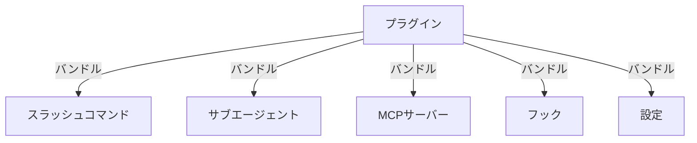
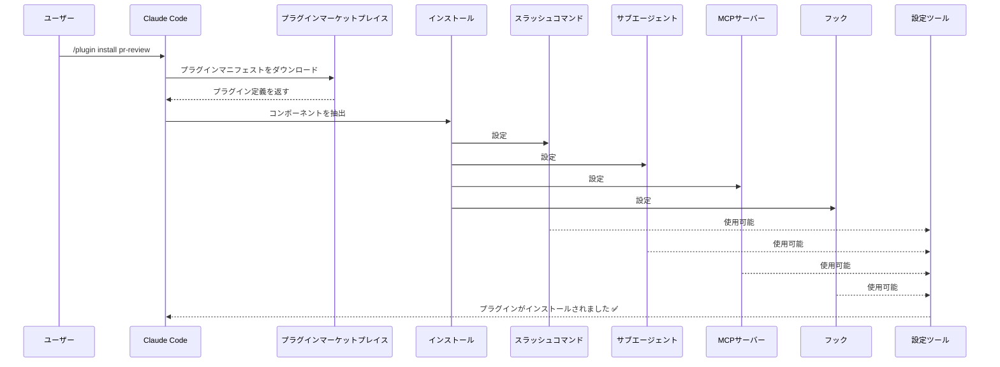
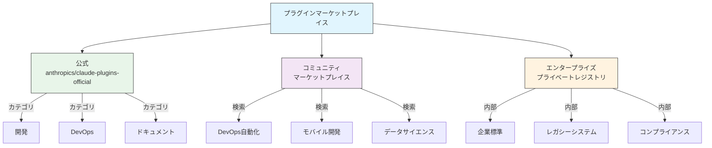
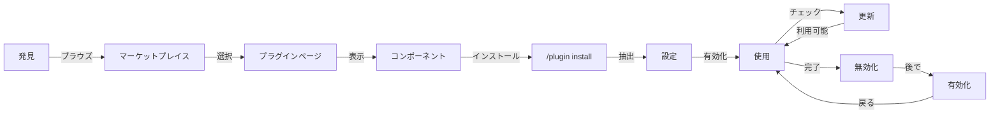
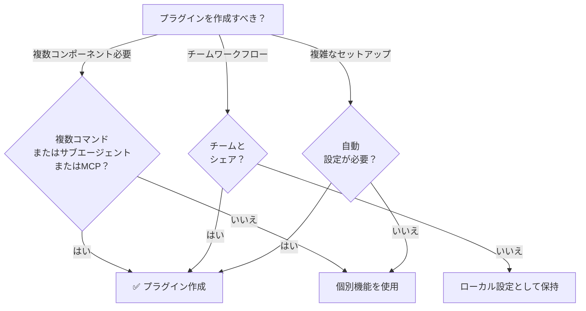

<picture>
  <source media="(prefers-color-scheme: dark)" srcset="../../resources/logos/claude-howto-logo-dark.svg">
  
</picture>

# Claude Code プラグイン

このフォルダには、複数のClaude Code機能を1つのインストール可能なパッケージにまとめた完全なプラグインの例が含まれています。

## 概要

Claude Code プラグインは、複数のカスタマイズ（スラッシュコマンド、サブエージェント、MCPサーバー、フック）をバンドルしたコレクションです。これらは最上位レベルの拡張機構を表しており、複数の機能を1つの統合されたシェアリング可能なパッケージに組み合わせます。

## プラグインアーキテクチャ



## プラグイン読み込みプロセス



## プラグインタイプと配布

| タイプ | スコープ | 共有 | 認可 | 例 |
|--------|---------|------|------|-----|
| 公式 | グローバル | すべてのユーザー | Anthropic | PRレビュー、セキュリティガイダンス |
| コミュニティ | パブリック | すべてのユーザー | コミュニティ | DevOps、データサイエンス |
| 組織 | 内部 | チームメンバー | 企業 | 内部標準、ツール |
| 個人 | 個人 | 単一ユーザー | 開発者 | カスタムワークフロー |

## プラグイン定義構造

プラグインマニフェストは`.claude-plugin/plugin.json`ファイル内のJSON形式を使用します：

```json
{
  "name": "my-first-plugin",
  "description": "A greeting plugin",
  "version": "1.0.0",
  "author": {
    "name": "Your Name"
  },
  "homepage": "https://example.com",
  "repository": "https://github.com/user/repo",
  "license": "MIT"
}
```

## プラグイン構造の例

```
my-plugin/
├── .claude-plugin/
│   └── plugin.json       # マニフェスト（名前、説明、バージョン、作成者）
├── commands/             # スキルをMarkdownファイルとして記述
│   ├── task-1.md
│   ├── task-2.md
│   └── workflows/
├── agents/               # カスタムエージェント定義
│   ├── specialist-1.md
│   ├── specialist-2.md
│   └── configs/
├── skills/               # SKILL.mdファイルを含むエージェントスキル
│   ├── skill-1.md
│   └── skill-2.md
├── hooks/                # hooks.jsonのイベントハンドラ
│   └── hooks.json
├── .mcp.json             # MCPサーバー設定
├── .lsp.json             # コード自動補完用のLSPサーバー設定
├── bin/                  # プラグイン有効時にBashツールのPATHに追加される実行ファイル
├── settings.json         # プラグイン有効時に適用されるデフォルト設定（現在は `agent` キーのみサポート）
├── templates/
│   └── issue-template.md
├── scripts/
│   ├── helper-1.sh
│   └── helper-2.py
├── docs/
│   ├── README.md
│   └── USAGE.md
└── tests/
    └── plugin.test.js
```

### LSP サーバー設定

プラグインはリアルタイムコード自動補完のためにLanguage Server Protocol (LSP) サポートを含めることができます。LSPサーバーは作業中に診断、コードナビゲーション、シンボル情報を提供します。

**設定場所**:
- プラグインのルートディレクトリの `.lsp.json` ファイル
- `plugin.json` インラインの `lsp` キー

#### フィールドリファレンス

| フィールド | 必須 | 説明 |
|-----------|------|------|
| `command` | はい | LSPサーバーのバイナリ（PATHに含まれている必要があります） |
| `extensionToLanguage` | はい | ファイル拡張子から言語IDへのマッピング |
| `args` | いいえ | サーバーのコマンドライン引数 |
| `transport` | いいえ | 通信方法：`stdio`（デフォルト）または `socket` |
| `env` | いいえ | サーバープロセスの環境変数 |
| `initializationOptions` | いいえ | LSP初期化時に送信されるオプション |
| `settings` | いいえ | サーバーに渡されるワークスペース設定 |
| `workspaceFolder` | いいえ | ワークスペースフォルダパスをオーバーライド |
| `startupTimeout` | いいえ | サーバー起動を待つ最大時間（ミリ秒） |
| `shutdownTimeout` | いいえ | グレースフルシャットダウンの最大時間（ミリ秒） |
| `restartOnCrash` | いいえ | サーバーがクラッシュした場合は自動的に再起動 |
| `maxRestarts` | いいえ | 終了前の最大再起動試行回数 |

#### 設定の例

**Go (gopls)**:

```json
{
  "go": {
    "command": "gopls",
    "args": ["serve"],
    "extensionToLanguage": {
      ".go": "go"
    }
  }
}
```

**Python (pyright)**:

```json
{
  "python": {
    "command": "pyright-langserver",
    "args": ["--stdio"],
    "extensionToLanguage": {
      ".py": "python",
      ".pyi": "python"
    }
  }
}
```

**TypeScript**:

```json
{
  "typescript": {
    "command": "typescript-language-server",
    "args": ["--stdio"],
    "extensionToLanguage": {
      ".ts": "typescript",
      ".tsx": "typescriptreact",
      ".js": "javascript",
      ".jsx": "javascriptreact"
    }
  }
}
```

#### 利用可能なLSPプラグイン

公式マーケットプレイスには事前に設定されたLSPプラグインが含まれています：

| プラグイン | 言語 | サーバーバイナリ | インストールコマンド |
|----------|------|----------------|-------------------|
| `pyright-lsp` | Python | `pyright-langserver` | `pip install pyright` |
| `typescript-lsp` | TypeScript/JavaScript | `typescript-language-server` | `npm install -g typescript-language-server typescript` |
| `rust-lsp` | Rust | `rust-analyzer` | `rustup component add rust-analyzer` でインストール |

#### LSP機能

設定したら、LSPサーバーは以下を提供します：

- **即座の診断** — エディット後すぐに エラーと警告が表示される
- **コードナビゲーション** — 定義へのジャンプ、参照検索、実装検索
- **ホバー情報** — ホバー時に型シグネチャとドキュメントを表示
- **シンボル一覧** — 現在のファイルまたはワークスペース内のシンボルを表示

## プラグインオプション (v2.1.83+)

プラグインは`userConfig`を通じてマニフェスト内でユーザー設定可能なオプションを宣言できます。`sensitive: true`とマークされた値は、プレーンテキスト設定ファイルではなくシステムキーチェーンに保存されます：

```json
{
  "name": "my-plugin",
  "version": "1.0.0",
  "userConfig": {
    "apiKey": {
      "description": "サービスのAPIキー",
      "sensitive": true
    },
    "region": {
      "description": "デプロイ領域",
      "default": "us-east-1"
    }
  }
}
```

## 永続的なプラグインデータ (`${CLAUDE_PLUGIN_DATA}`) (v2.1.78+)

プラグインは`${CLAUDE_PLUGIN_DATA}`環境変数経由で永続状態ディレクトリにアクセスできます。このディレクトリはプラグインごとに一意であり、セッション間で保持されるため、キャッシュ、データベース、その他の永続状態に適しています：

```json
{
  "hooks": {
    "PostToolUse": [
      {
        "command": "node ${CLAUDE_PLUGIN_DATA}/track-usage.js"
      }
    ]
  }
}
```

ディレクトリはプラグインがインストールされる時に自動的に作成されます。ここに保存されたファイルはプラグインがアンインストールされるまで保持されます。

## 設定経由のインラインプラグイン (`source: 'settings'`) (v2.1.80+)

プラグインは設定ファイル内に`source: 'settings'`フィールドを使用してマーケットプレイスエントリとしてインラインで定義できます。これにより、別のリポジトリやマーケットプレイスを必要とせずにプラグイン定義を直接埋め込むことが可能です：

```json
{
  "pluginMarketplaces": [
    {
      "name": "inline-tools",
      "source": "settings",
      "plugins": [
        {
          "name": "quick-lint",
          "source": "./local-plugins/quick-lint"
        }
      ]
    }
  ]
}
```

## プラグイン設定

プラグインは`settings.json`ファイルをシップしてデフォルト設定を提供できます。これは現在`agent`キーのみをサポートしており、プラグインのメインスレッドエージェントを設定します：

```json
{
  "agent": "agents/specialist-1.md"
}
```

プラグインが`settings.json`を含める場合、そのデフォルト値はインストール時に適用されます。ユーザーは独自のプロジェクトまたはユーザー設定でこれらの設定をオーバーライドできます。

## スタンドアロン対プラグインアプローチ

| アプローチ | コマンド名 | 設定 | 最適用途 |
|-----------|----------|-----|--------|
| **スタンドアロン** | `/hello` | CLAUDE.md内で手動設定 | 個人、プロジェクト固有 |
| **プラグイン** | `/plugin-name:hello` | plugin.json経由の自動化 | シェアリング、配布、チーム利用 |

クイックな個人的なワークフローには**スタンドアロンスラッシュコマンド**を使用します。複数の機能をバンドル、チームとシェア、または配布用に公開したい場合は**プラグイン**を使用します。

## 実践的な例

### 例1：PRレビュープラグイン

**ファイル:** `.claude-plugin/plugin.json`

```json
{
  "name": "pr-review",
  "version": "1.0.0",
  "description": "Complete PR review workflow with security, testing, and docs",
  "author": {
    "name": "Anthropic"
  },
  "repository": "https://github.com/your-org/pr-review",
  "license": "MIT"
}
```

**ファイル:** `commands/review-pr.md`

```markdown
---
name: Review PR
description: Start comprehensive PR review with security and testing checks
---

# PRレビュー

このコマンドは以下を含む完全なプルリクエストレビューを開始します：

1. セキュリティ分析
2. テストカバレッジ検証
3. ドキュメント更新
4. コード品質チェック
5. パフォーマンス影響評価
```

**ファイル:** `agents/security-reviewer.md`

```yaml
---
name: security-reviewer
description: Security-focused code review
tools: read, grep, diff
---

# セキュリティレビュアー

セキュリティ脆弱性の検出に特化：
- 認証/認可の問題
- データ露出
- インジェクション攻撃
- セキュア設定
```

**インストール:**

```bash
/plugin install pr-review

# 結果：
# ✅ 3つのスラッシュコマンドをインストール
# ✅ 3つのサブエージェントを設定
# ✅ 2つのMCPサーバーを接続
# ✅ 4つのフックを登録
# ✅ 使用準備完了！
```

### 例2：DevOpsプラグイン

**コンポーネント:**

```
devops-automation/
├── commands/
│   ├── deploy.md
│   ├── rollback.md
│   ├── status.md
│   └── incident.md
├── agents/
│   ├── deployment-specialist.md
│   ├── incident-commander.md
│   └── alert-analyzer.md
├── mcp/
│   ├── github-config.json
│   ├── kubernetes-config.json
│   └── prometheus-config.json
├── hooks/
│   ├── pre-deploy.js
│   ├── post-deploy.js
│   └── on-error.js
└── scripts/
    ├── deploy.sh
    ├── rollback.sh
    └── health-check.sh
```

### 例3：ドキュメントプラグイン

**バンドルされたコンポーネント:**

```
documentation/
├── commands/
│   ├── generate-api-docs.md
│   ├── generate-readme.md
│   ├── sync-docs.md
│   └── validate-docs.md
├── agents/
│   ├── api-documenter.md
│   ├── code-commentator.md
│   └── example-generator.md
├── mcp/
│   ├── github-docs-config.json
│   └── slack-announce-config.json
└── templates/
    ├── api-endpoint.md
    ├── function-docs.md
    └── adr-template.md
```

## プラグインマーケットプレイス

公式Anthropic管理のプラグインディレクトリは`anthropics/claude-plugins-official`です。エンタープライズ管理者は内部配布用にプライベートプラグインマーケットプレイスを作成することもできます。



### マーケットプレイス設定

エンタープライズおよび上級ユーザーは設定を通じてマーケットプレイスの動作を制御できます：

| 設定 | 説明 |
|-----|------|
| `extraKnownMarketplaces` | デフォルトを超えた追加のマーケットプレイスソースを追加 |
| `strictKnownMarketplaces` | ユーザーが追加を許可されるマーケットプレイスを制御 |
| `deniedPlugins` | 特定のプラグインのインストールを防ぐための管理者管理のブロックリスト |

### 追加のマーケットプレイス機能

- **デフォルトgitタイムアウト**: 大規模なプラグインリポジトリ用に30秒から120秒に増加
- **カスタムnpmレジストリ**: プラグインは依存性解決用のカスタムnpmレジストリURLを指定できます
- **バージョンピニング**: 再現可能な環境のためにプラグインを特定のバージョンにロック

### マーケットプレイス定義スキーマ

プラグインマーケットプレイスは`.claude-plugin/marketplace.json`で定義されます：

```json
{
  "name": "my-team-plugins",
  "owner": "my-org",
  "plugins": [
    {
      "name": "code-standards",
      "source": "./plugins/code-standards",
      "description": "Enforce team coding standards",
      "version": "1.2.0",
      "author": "platform-team"
    },
    {
      "name": "deploy-helper",
      "source": {
        "source": "github",
        "repo": "my-org/deploy-helper",
        "ref": "v2.0.0"
      },
      "description": "Deployment automation workflows"
    }
  ]
}
```

| フィールド | 必須 | 説明 |
|-----------|------|------|
| `name` | はい | ケバブケースのマーケットプレイス名 |
| `owner` | はい | マーケットプレイスを管理している組織またはユーザー |
| `plugins` | はい | プラグインエントリの配列 |
| `plugins[].name` | はい | プラグイン名（ケバブケース） |
| `plugins[].source` | はい | プラグインソース（パス文字列またはソースオブジェクト） |
| `plugins[].description` | いいえ | 簡潔なプラグイン説明 |
| `plugins[].version` | いいえ | セマンティックバージョン文字列 |
| `plugins[].author` | いいえ | プラグイン作成者名 |

### プラグインソースタイプ

プラグインは複数の場所からソースできます：

| ソース | 構文 | 例 |
|--------|------|-----|
| **相対パス** | 文字列パス | `"./plugins/my-plugin"` |
| **GitHub** | `{ "source": "github", "repo": "owner/repo" }` | `{ "source": "github", "repo": "acme/lint-plugin", "ref": "v1.0" }` |
| **Git URL** | `{ "source": "url", "url": "..." }` | `{ "source": "url", "url": "https://git.internal/plugin.git" }` |
| **Gitサブディレクトリ** | `{ "source": "git-subdir", "url": "...", "path": "..." }` | `{ "source": "git-subdir", "url": "https://github.com/org/monorepo.git", "path": "packages/plugin" }` |
| **npm** | `{ "source": "npm", "package": "..." }` | `{ "source": "npm", "package": "@acme/claude-plugin", "version": "^2.0" }` |
| **pip** | `{ "source": "pip", "package": "..." }` | `{ "source": "pip", "package": "claude-data-plugin", "version": ">=1.0" }` |

GitおよびGitソースは、バージョンピニング用のオプション`ref`（ブランチ/タグ）と`sha`（コミットハッシュ）フィールドをサポートします。

### 配布方法

**GitHub（推奨）**:
```bash
# ユーザーがマーケットプレイスを追加
/plugin marketplace add owner/repo-name
```

**その他のgitサービス**（完全なURLが必要）:
```bash
# ユーザーがマーケットプレイスを追加
/plugin marketplace add https://gitlab.com/org/marketplace-repo.git
```

**プライベートリポジトリ**: gitクレデンシャルヘルパーまたは環境トークン経由でサポートされています。ユーザーはリポジトリへの読み取りアクセス権を持つ必要があります。

**公式マーケットプレイス提出**: [claude.ai/settings/plugins/submit](https://claude.ai/settings/plugins/submit)または[platform.claude.com/plugins/submit](https://platform.claude.com/plugins/submit)を通じて、Anthropic管理のマーケットプレイスにプラグインを提出して、より広い配布を実現します。

### 厳格モード

マーケットプレイス定義がローカル`plugin.json`ファイルとどのように相互作用するかを制御します：

| 設定 | 動作 |
|-----|------|
| `strict: true`（デフォルト） | ローカル`plugin.json`が認可；マーケットプレイスエントリはそれを補足 |
| `strict: false` | マーケットプレイスエントリはプラグイン定義全体 |

**`strictKnownMarketplaces`を使用した組織制限**:

| 値 | 効果 |
|----|------|
| 未設定 | 制限なし — ユーザーは任意のマーケットプレイスを追加可能 |
| 空の配列`[]` | ロックダウン — マーケットプレイス不可 |
| パターンの配列 | 許可リスト — 一致するマーケットプレイスのみ追加可能 |

```json
{
  "strictKnownMarketplaces": [
    "my-org/*",
    "github.com/trusted-vendor/*"
  ]
}
```

> **警告**: 厳格モードで`strictKnownMarketplaces`が設定されている場合、ユーザーは許可リストに載っているマーケットプレイスからのみプラグインをインストールできます。これはエンタープライズ環境での制御されたプラグイン配布が必要な場合に便利です。

## プラグインのインストールとライフサイクル



## プラグイン機能比較

| 機能 | スラッシュコマンド | スキル | サブエージェント | プラグイン |
|-----|-----------------|-------|--------------|--------|
| **インストール** | 手動コピー | 手動コピー | 手動設定 | 1つのコマンド |
| **セットアップ時間** | 5分 | 10分 | 15分 | 2分 |
| **バンドリング** | シングルファイル | シングルファイル | シングルファイル | 複数 |
| **バージョニング** | 手動 | 手動 | 手動 | 自動 |
| **チームシェアリング** | ファイルコピー | ファイルコピー | ファイルコピー | インストールID |
| **更新** | 手動 | 手動 | 手動 | 自動利用可能 |
| **依存性** | なし | なし | なし | 含まれる可能性 |
| **マーケットプレイス** | いいえ | いいえ | いいえ | はい |
| **配布** | リポジトリ | リポジトリ | リポジトリ | マーケットプレイス |

## プラグインCLIコマンド

すべてのプラグイン操作はCLIコマンドとして利用可能です：

```bash
claude plugin install <name>@<marketplace>   # マーケットプレイスからインストール
claude plugin uninstall <name>               # プラグインを削除
claude plugin list                           # インストールされたプラグインを一覧
claude plugin enable <name>                  # 無効化されたプラグインを有効化
claude plugin disable <name>                 # プラグインを無効化
claude plugin validate                       # プラグイン構造を検証
```

## インストール方法

### マーケットプレイスからのインストール
```bash
/plugin install plugin-name
# または CLI から：
claude plugin install plugin-name@marketplace-name
```

### 有効化/無効化（スコープ自動検出付き）
```bash
/plugin enable plugin-name
/plugin disable plugin-name
```

### ローカルプラグイン（開発用）
```bash
# ローカルテスト用のCLIフラグ（複数プラグイン用に繰り返し可能）
claude --plugin-dir ./path/to/plugin
claude --plugin-dir ./plugin-a --plugin-dir ./plugin-b
```

### Gitリポジトリからのインストール
```bash
/plugin install github:username/repo
```

## プラグインを作成すべき場合



### プラグインユースケース

| ユースケース | 推奨事項 | 理由 |
|----------|--------|------|
| **チームオンボーディング** | ✅ プラグイン使用 | 即座のセットアップ、すべての設定 |
| **フレームワークセットアップ** | ✅ プラグイン使用 | フレームワーク固有のコマンドをバンドル |
| **エンタープライズ標準** | ✅ プラグイン使用 | 中央配布、バージョン管理 |
| **クイックタスク自動化** | ❌ コマンド使用 | 過度な複雑さ |
| **単一ドメイン専門知識** | ❌ スキル使用 | 重すぎる、スキルの代わりに使用 |
| **特化分析** | ❌ サブエージェント使用 | 手動で作成またはスキル使用 |
| **ライブデータアクセス** | ❌ MCP使用 | スタンドアロン、バンドルしない |

## プラグインのテスト

公開前に、`--plugin-dir` CLIフラグ（複数プラグイン用に繰り返し可能）を使用してプラグインをローカルでテストします：

```bash
claude --plugin-dir ./my-plugin
claude --plugin-dir ./my-plugin --plugin-dir ./another-plugin
```

これはプラグインをロードしたClaude Codeを起動し、以下を実行できます：
- すべてのスラッシュコマンドが利用可能か確認
- サブエージェントとエージェントが正しく機能するかテスト
- MCPサーバーが適切に接続するか確認
- フック実行を検証
- LSPサーバー設定をチェック
- 設定エラーをチェック

## ホットリロード

プラグインは開発中のホットリロードをサポートします。プラグインファイルを変更すると、Claude Codeは変更を自動的に検出できます。以下を使用して強制的にリロードすることもできます：

```bash
/reload-plugins
```

これはセッションを再起動せずに、すべてのプラグインマニフェスト、コマンド、エージェント、スキル、フック、MCP/LSP設定を再読み込みします。

## プラグイン用の管理設定

管理者は管理設定を使用して、組織全体でプラグインの動作を制御できます：

| 設定 | 説明 |
|-----|------|
| `enabledPlugins` | デフォルトで有効化されるプラグインの許可リスト |
| `deniedPlugins` | インストールできないプラグインのブロックリスト |
| `extraKnownMarketplaces` | デフォルトを超えた追加のマーケットプレイスソースを追加 |
| `strictKnownMarketplaces` | ユーザーが追加を許可されるマーケットプレイスを制限 |
| `allowedChannelPlugins` | リリースチャネルごとにどのプラグインが許可されるかを制御 |

これらの設定は管理設定ファイル経由で組織レベルで適用でき、ユーザーレベルの設定より優先されます。

## プラグインセキュリティ

プラグインサブエージェントは制限されたサンドボックスで実行されます。以下のフロントマターキーはプラグインサブエージェント定義では**許可されていません**：

- `hooks` -- サブエージェントはイベントハンドラを登録できない
- `mcpServers` -- サブエージェントはMCPサーバーを設定できない
- `permissionMode` -- サブエージェントはパーミッションモデルをオーバーライドできない

これはプラグインが宣言されたスコープを超えて権限をエスカレートまたはホスト環境を変更できないことを保証します。

## プラグインの公開

**公開のステップ：**

1. すべてのコンポーネント付きのプラグイン構造を作成
2. `.claude-plugin/plugin.json`マニフェストを記述
3. ドキュメント付きで`README.md`を作成
4. `claude --plugin-dir ./my-plugin`でローカルテスト
5. プラグインマーケットプレイスに提出
6. レビューと承認を取得
7. マーケットプレイスに公開
8. ユーザーは1つのコマンドでインストール可能

**提出例：**

```markdown
# PRレビュープラグイン

## 説明
セキュリティ、テスト、ドキュメントチェック付きの完全なPRレビューワークフロー。

## 含まれるもの
- 異なるレビュータイプ用の3つのスラッシュコマンド
- 3つの特化したサブエージェント
- GitHubとCodeQL MCP統合
- 自動セキュリティスキャンフック

## インストール
```bash
/plugin install pr-review
```

## 機能
✅ セキュリティ分析
✅ テストカバレッジチェック
✅ ドキュメント検証
✅ コード品質評価
✅ パフォーマンス影響分析

## 使用法
```bash
/review-pr
/check-security
/check-tests
```

## 要件
- Claude Code 1.0+
- GitHubアクセス
- CodeQL（オプション）
```

## プラグイン対手動設定

**手動セットアップ（2時間以上）:**
- スラッシュコマンドを1つずつインストール
- サブエージェントを個別に作成
- MCPを個別に設定
- フックを手動で設定
- すべてをドキュメント化
- チームとシェア（彼らが正しく設定することを期待）

**プラグイン使用（2分）:**
```bash
/plugin install pr-review
# ✅ すべてがインストールおよび設定されました
# ✅ 即座に使用可能
# ✅ チームが正確なセットアップを再現可能
```

## ベストプラクティス

### すべきこと ✅
- 明確で説明的なプラグイン名を使用
- 包括的なREADMEを含める
- プラグインを適切にバージョン化（semver）
- すべてのコンポーネントを一緒にテスト
- 要件を明確にドキュメント化
- 使用例を提供
- エラーハンドリングを含める
- 発見のため適切にタグ付け
- 後方互換性を維持
- プラグインを焦点を絞ってコヒーシブに保つ
- 包括的なテストを含める
- すべての依存性をドキュメント化

### してはいけないこと ❌
- 関連性のない機能をバンドルしない
- クレデンシャルをハードコードしない
- テストをスキップしない
- ドキュメントを忘れない
- 冗長なプラグインを作成しない
- バージョニングを無視しない
- コンポーネント間の依存性を過度に複雑にしない
- エラーを適切に処理することを忘れない

## インストール手順

### マーケットプレイスからのインストール

1. **利用可能なプラグインをブラウズ:**
   ```bash
   /plugin list
   ```

2. **プラグイン詳細を表示:**
   ```bash
   /plugin info plugin-name
   ```

3. **プラグインをインストール:**
   ```bash
   /plugin install plugin-name
   ```

### ローカルパスからのインストール

```bash
/plugin install ./path/to/plugin-directory
```

### GitHubからのインストール

```bash
/plugin install github:username/repo
```

### インストール済みプラグインの一覧表示

```bash
/plugin list --installed
```

### プラグインを更新

```bash
/plugin update plugin-name
```

### プラグインを無効化/有効化

```bash
# 一時的に無効化
/plugin disable plugin-name

# 再度有効化
/plugin enable plugin-name
```

### プラグインをアンインストール

```bash
/plugin uninstall plugin-name
```

## 関連コンセプト

以下のClaude Code機能はプラグインと連携して機能します：

- **[スラッシュコマンド](../../01-slash-commands/)** - プラグインにバンドルされた個別コマンド
- **[メモリ](../../02-memory/)** - プラグインの永続コンテキスト
- **[スキル](../../03-skills/)** - プラグインにラップできるドメイン専門知識
- **[サブエージェント](../../04-subagents/)** - プラグインコンポーネントとして含まれる特化したエージェント
- **[MCPサーバー](../../05-mcp/)** - プラグインにバンドルされたModel Context Protocol統合
- **[フック](../../06-hooks/)** - プラグインワークフローをトリガーするイベントハンドラ

## 完全なワークフロー例

### PRレビュープラグイン完全ワークフロー

```
1. ユーザー: /review-pr

2. プラグインが実行：
   ├── pre-review.js フックがgitリポジトリを検証
   ├── GitHub MCP がPRデータを取得
   ├── security-reviewer サブエージェントがセキュリティを分析
   ├── test-checker サブエージェントがカバレッジを検証
   └── performance-analyzer サブエージェントがパフォーマンスをチェック

3. 結果が合成され提示：
   ✅ セキュリティ：重大な問題なし
   ⚠️  テスト：カバレッジ65％（80%+を推奨）
   ✅ パフォーマンス：大きな影響なし
   📝 12の推奨事項を提供
```

## トラブルシューティング

### プラグインがインストールできない
- Claude Codeバージョンの互換性をチェック: `/version`
- JSONバリデータで`plugin.json`構文を検証
- インターネット接続を確認（リモートプラグイン向け）
- パーミッションを確認: `ls -la plugin/`

### コンポーネントがロードされない
- `plugin.json`内のパスが実際のディレクトリ構造と一致するか確認
- ファイルパーミッションを確認: `chmod +x scripts/`
- コンポーネントファイル構文を確認
- ログを確認: `/plugin debug plugin-name`

### MCP接続に失敗
- 環境変数が正しく設定されているか確認
- MCPサーバーのインストールと健全性をチェック
- MCPサーバー接続を独立してテスト: `/mcp test`
- `mcp/`ディレクトリのMCP設定を確認

### インストール後コマンドが利用できない
- プラグインが正常にインストールされたか確認: `/plugin list --installed`
- プラグインが有効になっているか確認: `/plugin status plugin-name`
- Claude Codeを再起動: `exit`して再度開く
- 既存のコマンドとの命名競合をチェック

### フック実行の問題
- フックファイルが正しいパーミッションを持っているか確認
- フック構文とイベント名を確認
- エラー詳細をフックログで確認
- 可能な場合はフックを手動でテスト

## 追加リソース

- [公式プラグインドキュメンテーション](https://code.claude.com/docs/en/plugins)
- [プラグインを発見](https://code.claude.com/docs/en/discover-plugins)
- [プラグインマーケットプレイス](https://code.claude.com/docs/en/plugin-marketplaces)
- [プラグインリファレンス](https://code.claude.com/docs/en/plugins-reference)
- [MCPサーバーリファレンス](https://modelcontextprotocol.io/)
- [サブエージェント設定ガイド](../../04-subagents/README.md)
- [フックシステムリファレンス](../../06-hooks/README.md)

---
**最終更新**: 2026年4月9日
**Claude Code バージョン**: 2.1.97
**互換モデル**: Claude Sonnet 4.6、Claude Opus 4.6、Claude Haiku 4.5
