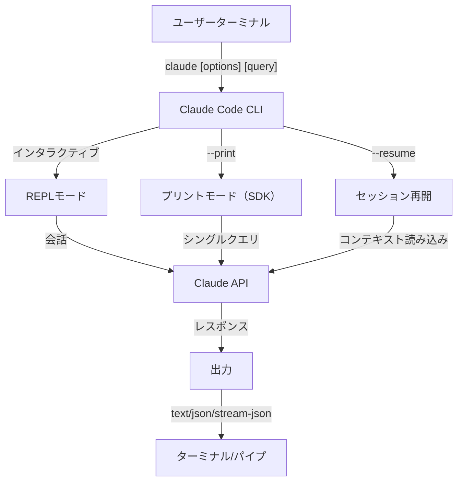
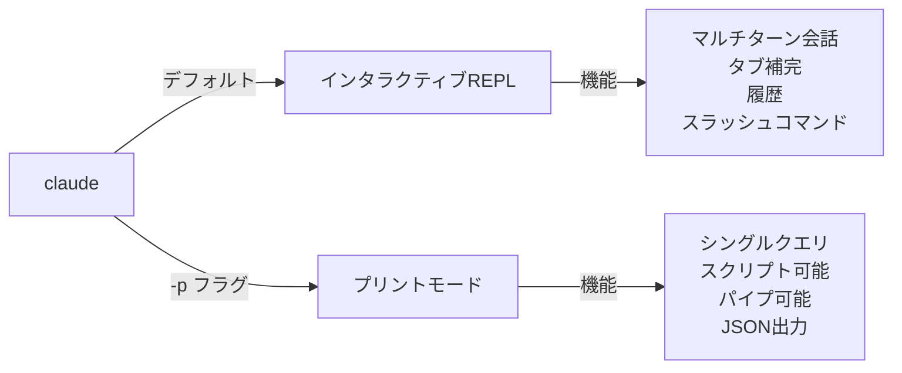

<picture>
  <source media="(prefers-color-scheme: dark)" srcset="../../resources/logos/claude-howto-logo-dark.svg">
  
</picture>

# CLIリファレンス

## 概要

Claude Code CLI（コマンドラインインターフェース）は、Claude Codeと相互作用する主な方法です。クエリ実行、セッション管理、モデル設定、開発ワークフローへのClaudeの統合のための強力なオプションを提供します。

## アーキテクチャ



## CLIコマンド

| コマンド | 説明 | 例 |
|---------|------|-----|
| `claude` | インタラクティブREPLを開始 | `claude` |
| `claude "query"` | 初期プロンプト付きREPLを開始 | `claude "このプロジェクトを説明"` |
| `claude -p "query"` | プリントモード - クエリしてから終了 | `claude -p "この関数を説明"` |
| `cat file \| claude -p "query"` | パイプされたコンテンツを処理 | `cat logs.txt \| claude -p "説明"` |
| `claude -c` | 最新の会話を続行 | `claude -c` |
| `claude -c -p "query"` | プリントモードで続行 | `claude -c -p "型エラーをチェック"` |
| `claude -r "<session>" "query"` | IDまたは名前でセッション再開 | `claude -r "auth-refactor" "このPRを完了"` |
| `claude update` | 最新バージョンに更新 | `claude update` |
| `claude mcp` | MCPサーバーを設定 | [MCPドキュメンテーション](../../05-mcp/)を参照 |
| `claude mcp serve` | MCPサーバーとしてClaude Codeを実行 | `claude mcp serve` |
| `claude agents` | 設定されたすべてのサブエージェントをリスト | `claude agents` |
| `claude auto-mode defaults` | オートモード デフォルトルールをJSONとして出力 | `claude auto-mode defaults` |
| `claude remote-control` | リモートコントロール サーバー開始 | `claude remote-control` |
| `claude plugin` | プラグイン管理（インストール、有効化、無効化） | `claude plugin install my-plugin` |
| `claude auth login` | ログイン（`--email`、`--sso`をサポート） | `claude auth login --email user@example.com` |
| `claude auth logout` | 現在のアカウントからログアウト | `claude auth logout` |
| `claude auth status` | 認証ステータスをチェック（0終了、ログイン時は1） | `claude auth status` |

## コアフラグ

| フラグ | 説明 | 例 |
|--------|------|-----|
| `-p, --print` | インタラクティブモードなしでレスポンス出力 | `claude -p "query"` |
| `-c, --continue` | 最新の会話をロード | `claude --continue` |
| `-r, --resume` | IDまたは名前で特定のセッション再開 | `claude --resume auth-refactor` |
| `-v, --version` | バージョン番号を出力 | `claude -v` |
| `-w, --worktree` | 隔離されたgit ワークツリーで開始 | `claude -w` |
| `-n, --name` | セッション表示名 | `claude -n "auth-refactor"` |
| `--from-pr <number>` | GitHub PRにリンクされたセッション再開 | `claude --from-pr 42` |
| `--remote "task"` | claude.ai上でウェブセッションを作成 | `claude --remote "API実装"` |
| `--remote-control, --rc` | リモートコントロール付きインタラクティブセッション | `claude --rc` |
| `--teleport` | ウェブセッションをローカルで再開 | `claude --teleport` |
| `--teammate-mode` | エージェントチーム表示モード | `claude --teammate-mode tmux` |
| `--bare` | 最小モード（フック、スキル、プラグイン、MCP、自動メモリ、CLAUDE.mdをスキップ） | `claude --bare` |
| `--enable-auto-mode` | オートパーミッションモードをロック解除 | `claude --enable-auto-mode` |
| `--channels` | MCPチャネルプラグインを購読 | `claude --channels discord,telegram` |
| `--chrome` / `--no-chrome` | Chrome ブラウザ統合を有効/無効化 | `claude --chrome` |
| `--effort` | 思考努力レベルを設定 | `claude --effort high` |
| `--init` / `--init-only` | 初期化フックを実行 | `claude --init` |
| `--maintenance` | メンテナンスフックを実行して終了 | `claude --maintenance` |
| `--disable-slash-commands` | すべてのスキルとスラッシュコマンドを無効化 | `claude --disable-slash-commands` |
| `--no-session-persistence` | セッション保存を無効化（プリントモード） | `claude -p --no-session-persistence "query"` |

### インタラクティブ対プリントモード



**インタラクティブモード**（デフォルト）:
```bash
# インタラクティブセッション開始
claude

# 初期プロンプト付きで開始
claude "認証フローを説明"
```

**プリントモード**（非インタラクティブ）:
```bash
# シングルクエリしてから終了
claude -p "この関数は何をしますか？"

# ファイルコンテンツを処理
cat error.log | claude -p "このエラーを説明"

# 他のツールと連鎖
claude -p "todos をリスト" | grep "URGENT"
```

## モデルと設定

| フラグ | 説明 | 例 |
|--------|------|-----|
| `--model` | モデル設定（sonnet、opus、haiku、またはフルネーム） | `claude --model opus` |
| `--fallback-model` | 過負荷時の自動モデルフォールバック | `claude -p --fallback-model sonnet "query"` |
| `--agent` | セッション用エージェント指定 | `claude --agent my-custom-agent` |
| `--agents` | JSON経由でカスタムサブエージェント定義 | [エージェント設定](#エージェント設定)を参照 |
| `--effort` | 努力レベル設定（low、medium、high、max） | `claude --effort high` |

### モデル選択例

```bash
# 複雑なタスク用のOpus 4.6を使用
claude --model opus "キャッシング戦略を設計"

# クイックタスク用のHaiku 4.5を使用
claude --model haiku -p "このJSONをフォーマット"

# フルモデル名を使用
claude --model claude-sonnet-4-6-20250929 "このコードをレビュー"

# フォールバック付き
claude -p --model opus --fallback-model sonnet "アーキテクチャ分析"

# opusplan を使用（Opusが計画、Sonnetが実行）
claude --model opusplan "キャッシングレイヤーを設計・実装"
```

## システムプロンプトのカスタマイズ

| フラグ | 説明 | 例 |
|--------|------|-----|
| `--system-prompt` | デフォルトプロンプト全体を置換 | `claude --system-prompt "あなたはPythonエキスパート"` |
| `--system-prompt-file` | ファイルからプロンプトロード（プリントモード） | `claude -p --system-prompt-file ./prompt.txt "query"` |
| `--append-system-prompt` | デフォルトプロンプトに追加 | `claude --append-system-prompt "常にTypeScript使用"` |

## ツールと許可管理

| フラグ | 説明 | 例 |
|--------|------|-----|
| `--tools` | 利用可能な組み込みツール制限 | `claude -p --tools "Bash,Edit,Read" "query"` |
| `--allowedTools` | プロンプトなして実行するツール | `"Bash(git log:*)" "Read"` |
| `--disallowedTools` | コンテキストから削除されたツール | `"Bash(rm:*)" "Edit"` |
| `--dangerously-skip-permissions` | すべての許可プロンプトをスキップ | `claude --dangerously-skip-permissions` |
| `--permission-mode` | 指定された許可モードで開始 | `claude --permission-mode auto` |
| `--enable-auto-mode` | オートパーミッションモードをロック解除 | `claude --enable-auto-mode` |

## 出力とフォーマット

| フラグ | 説明 | オプション | 例 |
|--------|------|-----------|-----|
| `--output-format` | 出力フォーマット指定（プリントモード） | `text`、`json`、`stream-json` | `claude -p --output-format json "query"` |
| `--input-format` | 入力フォーマット指定（プリントモード） | `text`、`stream-json` | `claude -p --input-format stream-json` |
| `--verbose` | 詳細ログを有効化 | | `claude --verbose` |
| `--include-partial-messages` | ストリーミングイベント含む | `stream-json`必須 | `claude -p --output-format stream-json --include-partial-messages "query"` |
| `--json-schema` | スキーマ検証JSON出力 | | `claude -p --json-schema '{"type":"object"}' "query"` |
| `--max-budget-usd` | プリントモード最大支出 | | `claude -p --max-budget-usd 5.00 "query"` |

## ワークスペースとディレクトリ

| フラグ | 説明 | 例 |
|--------|------|-----|
| `--add-dir` | 追加の作業ディレクトリを追加 | `claude --add-dir ../apps ../lib` |
| `--setting-sources` | カンマ区切り設定ソース | `claude --setting-sources user,project` |
| `--settings` | ファイルまたはJSONから設定ロード | `claude --settings ./settings.json` |
| `--plugin-dir` | ディレクトリからプラグインロード（繰り返し可能） | `claude --plugin-dir ./my-plugin` |

## セッション管理

| フラグ | 説明 | 例 |
|--------|------|-----|
| `--session-id` | 特定のセッションID使用（UUID） | `claude --session-id "550e8400-..."` |
| `--fork-session` | 再開時に新しいセッション作成 | `claude --resume abc123 --fork-session` |

## 高価値ユースケース

### 1. CI/CD統合

**GitHub Actions例:**

```yaml
name: AI Code Review

on: [pull_request]

jobs:
  review:
    runs-on: ubuntu-latest
    steps:
      - uses: actions/checkout@v4

      - name: Install Claude Code
        run: npm install -g @anthropic-ai/claude-code

      - name: Run Code Review
        env:
          ANTHROPIC_API_KEY: ${{ secrets.ANTHROPIC_API_KEY }}
        run: |
          claude -p --output-format json \
            --max-turns 1 \
            "このPRの変更をレビュー:
            - セキュリティ脆弱性
            - パフォーマンス問題
            - コード品質
            出力をJSONで" > review.json
```

### 2. スクリプトパイピング

```bash
# エラーログを分析
tail -1000 /var/log/app/error.log | claude -p "これらのエラーを要約"

# アクセスログの パターン検索
cat access.log | claude -p "疑わしいアクセスパターンを特定"

# git履歴を分析
git log --oneline -50 | claude -p "最近の開発活動を要約"
```

### 3. マルチセッションワークフロー

```bash
# フィーチャーブランチセッション開始
claude -r "feature-auth" "ユーザー認証を実装しましょう"

# 後でセッション続行
claude -r "feature-auth" "パスワードリセット機能を追加"

# 代替アプローチを試す
claude --resume feature-auth --fork-session "OAuthを試す"

# 異なるフィーチャーセッション間で切り替え
claude -r "feature-payments" "Stripe統合を続行"
```

### 4. JSON API統合

```bash
# 構造化分析取得
claude -p --output-format json \
  --json-schema '{"type":"object","properties":{"functions":{"type":"array"}}}' \
  "main.pyを分析して関数をリスト"

# jqで処理
claude -p --output-format json "すべてのAPIエンドポイント をリスト" | jq '.endpoints[]'

# スクリプトで使用
RESULT=$(claude -p --output-format json "このコードは安全？{secure: boolean, issues: []}で答える" < code.py)
if echo "$RESULT" | jq -e '.secure == false' > /dev/null; then
  echo "セキュリティ問題が見つかりました！"
  echo "$RESULT" | jq '.issues[]'
fi
```

## モデル

Claude Codeは異なる機能を備えた複数のモデルをサポートしています：

| モデル | ID | コンテキストウィンドウ | 注記 |
|--------|-----|----------------|-------|
| Opus 4.6 | `claude-opus-4-6` | 1Mトークン | 最も機能豊富、適応型努力レベル |
| Sonnet 4.6 | `claude-sonnet-4-6` | 1Mトークン | スピードと機能のバランス |
| Haiku 4.5 | `claude-haiku-4-5` | 1Mトークン | 最速、クイックタスクに最適 |

### モデル選択

```bash
# 短い名前を使用
claude --model opus "複雑なアーキテクチャレビュー"
claude --model sonnet "この機能を実装"
claude --model haiku -p "このJSONをフォーマット"

# opusPlanエイリアス（Opusが計画、Sonnetが実行）
claude --model opusplan "APIを設計・実装"
```

### 努力レベル（Opus 4.6）

Opus 4.6は適応型推論を支持します：

```bash
# CLIフラグ経由で努力レベルを設定
claude --effort high "複雑なレビュー"

# スラッシュコマンド経由
/effort high

# 環境変数経由
export CLAUDE_CODE_EFFORT_LEVEL=high   # low、medium、high、またはmax（Opus 4.6のみ）
```

## 主要な環境変数

| 変数 | 説明 |
|------|------|
| `ANTHROPIC_API_KEY` | 認証用APIキー |
| `ANTHROPIC_MODEL` | デフォルトモデルをオーバーライド |
| `ANTHROPIC_CUSTOM_MODEL_OPTION` | API用カスタムモデルオプション |
| `MAX_THINKING_TOKENS` | 拡張思考トークン予算を設定 |
| `CLAUDE_CODE_EFFORT_LEVEL` | 努力レベル設定（`low`/`medium`/`high`/`max`） |
| `CLAUDE_CODE_SIMPLE` | 最小モード、`--bare`フラグで設定 |
| `CLAUDE_CODE_DISABLE_AUTO_MEMORY` | 自動CLAUDE.md更新を無効化 |
| `CLAUDE_CODE_ENABLE_PROMPT_SUGGESTION` | プロンプト提案を切り替え（`true`/`false`） |

## トラブルシューティング

### コマンドが見つかりません

**問題**: `claude: command not found`

**解決策**:
- Claude Code インストール: `npm install -g @anthropic-ai/claude-code`
- PATHにnpm グローバルbinディレクトリを含むことを確認
- フルパスで実行してみてください: `npx claude`

### API キー問題

**問題**: 認証に失敗しました

**解決策**:
- APIキーを設定: `export ANTHROPIC_API_KEY=your-key`
- キーが有効で十分なクレジットを持つことを確認
- リクエストされたモデルの権限を確認

### セッション見つかりません

**問題**: セッション再開できません

**解決策**:
- 正しい名前/IDを見つけるために利用可能なセッションをリスト
- セッションは非アクティブ期間後に失敗する可能性があります
- 最新のセッション続行に`-c`を使用

## 追加リソース

- **[公式CLIリファレンス](https://code.claude.com/docs/en/cli-reference)** - 完全なコマンドリファレンス
- **[ヘッドレスモードドキュメンテーション](https://code.claude.com/docs/en/headless)** - 自動実行
- **[スラッシュコマンド](../../01-slash-commands/)** - Claude内でのカスタムショートカット
- **[メモリガイド](../../02-memory/)** - CLAUDE.md経由の永続コンテキスト
- **[MCPプロトコル](../../05-mcp/)** - 外部ツール統合
- **[高度な機能](../../09-advanced-features/)** - プランニングモード、拡張思考
- **[サブエージェントガイド](../../04-subagents/)** - 委譲されたタスク実行

---

*[Claude How To](../)ガイドシリーズの一部*

---
**最終更新**: 2026年4月9日
**Claude Code バージョン**: 2.1.97
**互換モデル**: Claude Sonnet 4.6、Claude Opus 4.6、Claude Haiku 4.5
