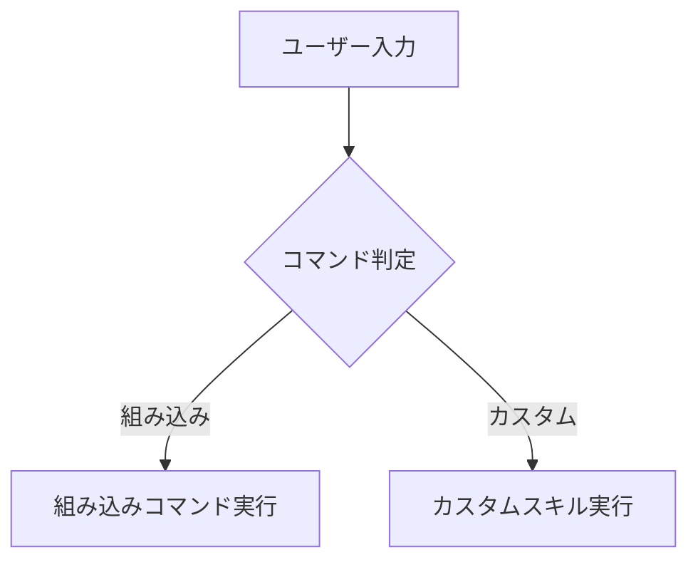

# 翻訳用語集 & スタイルガイド

# Translation Glossary & Style Guide

> **重要:** このドキュメントは Claude Code のドキュメントを日本語に翻訳する際のガイドラインです。翻訳を始める前に必ずお読みください。

## 技術用語 / Technical Terminology

以下は翻訳全体で統一すべき技術用語の対応表です：

| 英語 | 日本語 | 備考 |
|------|--------|------|
| slash command | スラッシュコマンド | カタカナ表記 |
| hook | フック | カタカナ表記（技術用語） |
| skill | スキル | カタカナ表記（Claude Code 固有の概念） |
| subagent | サブエージェント | カタカナ表記 |
| agent | エージェント | カタカナ表記 |
| memory | メモリ | カタカナ表記（Claude Code のメモリ機能） |
| checkpoint | チェックポイント | カタカナ表記 |
| plugin | プラグイン | カタカナ表記 |
| pull request / PR | プルリクエスト / PR | カタカナ表記、略称はそのまま |
| commit | コミット | カタカナ表記 |
| branch | ブランチ | カタカナ表記 |
| merge | マージ | カタカナ表記 |
| MCP (Model Context Protocol) | MCP | そのまま使用（プロトコル名） |
| CLAUDE.md | CLAUDE.md | ファイル名はそのまま |
| prompt | プロンプト | カタカナ表記 |
| workflow | ワークフロー | カタカナ表記 |
| repository | リポジトリ | カタカナ表記 |
| issue | Issue | そのまま使用（GitHub 用語） |
| release | リリース | カタカナ表記 |
| API | API | そのまま使用 |
| CLI | CLI | そのまま使用（Command-Line Interface の略） |
| CI/CD | CI/CD | そのまま使用 |
| pre-commit hook | pre-commit フック | コマンド部分はそのまま |
| environment variable | 環境変数 | 日本語訳 |
| dependencies | 依存関係 | 日本語訳 |
| template | テンプレート | カタカナ表記 |
| frontmatter | フロントマター | カタカナ表記 |
| boilerplate | ボイラープレート | カタカナ表記 |
| linter / lint | リンター / リント | カタカナ表記 |
| refactoring | リファクタリング | カタカナ表記 |
| code review | コードレビュー | カタカナ表記 |
| debugging | デバッグ | カタカナ表記 |
| deployment | デプロイ | カタカナ表記 |
| rollback | ロールバック | カタカナ表記 |
| incident | インシデント | カタカナ表記 |
| monitoring | モニタリング | カタカナ表記 |

## 翻訳ルール / Translation Rules

### 1. コードスニペットとコマンド

**ゴールデンルール：** 実行可能なコードは 100% そのまま保持する。翻訳するのはコメントと説明文のみ。

**正しい例（✅）：**

````markdown
このコマンドを使用するには、以下を実行します：

```bash
/optimize
```

このコマンドはコードを分析します。
````

**間違った例（❌）：**

````markdown
このコマンドを使用するには、以下を実行します：

```bash
/最適化  # コマンドは絶対に翻訳しない
```
````

### 2. コード内のコメント

コメントは日本語に翻訳して読みやすくします：

```python
# ✅ 正しい - コメントを翻訳
# このスラッシュコマンドはコードを最適化します
def optimize_code():
    pass

# ❌ 間違い - 関数名は翻訳しない
def コード最適化():  # 関数名は翻訳しない
    pass
```

### 3. Mermaid ダイアグラム

- ノードのラベルテキストは日本語に翻訳する
- ノード ID やキーワード（`graph`, `subgraph`, `end` など）はそのまま
- 矢印のラベルは日本語に翻訳可能



### 4. 見出しとタイトル

- セクション見出しは日本語に翻訳する
- 固有名詞（Claude Code、MCP など）はそのまま
- ファイル名やパスはそのまま

### 5. リンクとクロスリファレンス

- 内部リンクのパスは `ja/` プレフィックス付きに更新する
- 外部リンクはそのまま
- アンカーリンクは翻訳後の見出しに合わせて更新する

### 6. 文体

- 「です・ます」調で統一する
- 専門用語は初出時に英語を括弧書きで併記する（例：「スラッシュコマンド（Slash Command）」）
- 簡潔で分かりやすい表現を心がける
